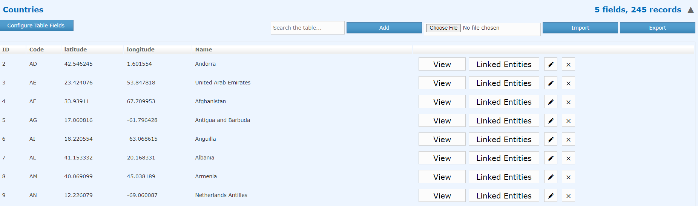

Authority Records API
~~~~~~~~~~~~~~~~~~~~~~~~~~~~~~

This API is used for managing the controlled vocabulary (Authority) records within Preservica.

Controlled vocabularies within Preservica are tables of records which can be linked to specific metadata attributes.
Each table can consist of multiple records and each record has multiple fields.

Authority Tables
^^^^^^^^^^^^^^^^^^^^^

Fetch a list of all Authority tables

.. code-block:: python

    authority = AuthorityAPI()

    for table in authority.tables():
        print(table)

Get a single Authority table by its reference

.. code-block:: python

    authority = AuthorityAPI()

    table = authority.table(ref):

Authority Records
^^^^^^^^^^^^^^^^^^^^^

Fetch a record by its reference

.. code-block:: python

    authority = AuthorityAPI()

    record = authority.record(reference)

Fetch all records from a table

.. code-block:: python

    authority = AuthorityAPI()

    table = authority.table(ref):

    for record in authority.records(table):
        print(record)

Add a new authority record to an existing table, the record is a Python dictionary object

.. code-block:: python

    authority = AuthorityAPI()

    table = authority.table(ref):

    record  = {"id": "6", "Code": "BE",  "Latitude": "50.503887", "Longitude": "4.469936", "Name": "Belgium"}

    authority.add_record(table, record)

Adding records from a CSV document

.. code-block:: python

    authority = AuthorityAPI()

    table = authority.table(ref):

    authority.add_records(table, "countries.csv")

If the CSV document was saved from a MS Excel workbook, then the encoding should be set to utf-8-sig

.. code-block:: python

    authority = AuthorityAPI()

    table = authority.table(ref):

    authority.add_records(table, "countries.csv", encoding="utf-8-sig")

Deleting Records from a table by its reference

.. code-block:: python

    authority = AuthorityAPI()

    table = authority.table(ref):

    authority.delete_record(table, reference)

To delete all records from a table

.. code-block:: python

    authority = AuthorityAPI()

    table = authority.table(ref):

    for record in authority.records(table):
        authority.delete_record(table, record['ref'])