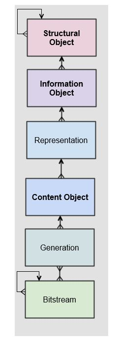
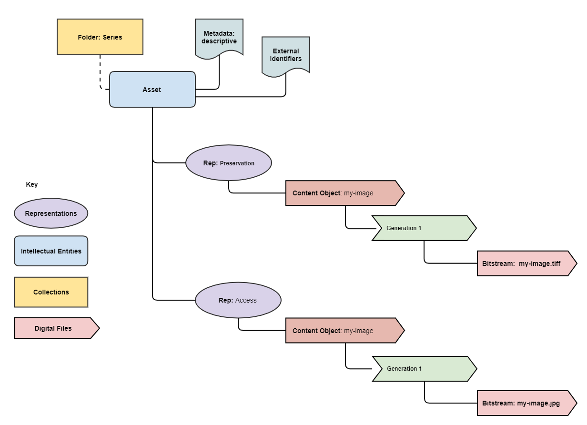

Welcome to pyPreservica's documentation
========================================

.. image:: https://pepy.tech/badge/pyPreservica
    :target: https://pepy.tech/project/pyPreservica

.. image:: https://img.shields.io/pypi/l/pyPreservica.svg
    :target: https://pypi.org/project/pyPreservica/

.. image:: https://img.shields.io/pypi/wheel/pyPreservica.svg
    :target: https://pypi.org/project/pyPreservica/

.. image:: https://img.shields.io/pypi/pyversions/pyPreservica.svg
    :target: https://pypi.org/project/pyPreservica/

pyPreservica is a Python client for the Preservica API Services

This library provides a Python class for working with the Preservica Rest API

https://developers.preservica.com/api-reference

This version of the documentation is for use against a Preservica 6.3/6.2 system

For Preservica 6.0 and 6.1 see `the previous version <https://pypreservica.readthedocs.io/en/v6.1/>`_

-------------------

.. default-domain:: py
.. py:module:: pyPreservica

.. contents:: Table of Contents
    :local:

Why Should I Use This?
----------------------

The goal of pyPreservica is to allow you to make use of the Preservica Entity API for reading and writing objects within
a Preservica repository without having to manage the underlying REST HTTPS requests and XML parsing.
The library provides a level of abstraction which reflects the underlying data model, such as structural and
information objects.

The pyPreservica library allows Preservica users to build applications which interact with the repository such as metadata
synchronisation with 3rd party systems etc.

.. hint::
    Access to the Preservica API's for the cloud hosted system does depend on which Preservica Edition has been
    licensed.  See https://preservica.com/digital-archive-software/products-editions for details.

Entity API Features
-----------------------

-  Fetch and Update Entity Objects (Folders, Assets, Content Objects)
-  Add, Delete and Update External Identifiers
-  Add, Delete and Update Descriptive Metadata Fragments
-  Change Security tags on Folders and Assets
-  Create new Folder Entities
-  Move Assets and Folders within the repository
-  Deleting Assets and Folders    (**New in 6.2**)
-  Fetch Folders and Assets belonging to parent Folders
-  Retrieve Representations, Generations & Bitstreams from Assets
-  Download digital files and thumbnails
-  Fetch lists of changed entities over the last n days
-  Request information on completed integrity checks   (**New in 6.2**)
-  Add or remove asset and folder icons   (**New in 6.2**)
-  Replace existing content objects within an Asset   (**New in 6.2**)
-  Export OPEX Package   (**New in 6.2**)
-  Fetch audit trail events on Entities and across the repository

Content API Features
---------------------

-  Fetch a list of indexed Solr Fields
-  Search based on a single query term

Upload API Features
---------------------

-  Create single Content Object Packages with multiple Representations
-  Create multiple Content Object Packages with multiple Representations
-  Upload packages to Preservica
-  Spreadsheet Metadata
-  Ingest Web Video
-  Ingest Twitter Feeds

Background
-----------

They key to working with the pyPreservica library is that the services follow the Preservica core data model closely.

The Preservica data model represents a hierarchy of entities, starting with the **structural objects** which are used to
represent aggregations of digital assets. Structural objects define the organisation of the data. In a library context
they may be referred to as collections, in an archival context they may be Fonds, Sub-Fonds, Series etc and in a
records management context they could be simply a hierarchy of folders or directories.

These structural objects may contain other structural objects in the same way as a computer filesystem may contain
folders within folders.

Within the structural objects comes the **information objects**. These objects which are sometimes referred to as the
digital assets are what PREMIS defines as an Intellectual Entity. Information objects are considered a single
intellectual unit for purposes of management and description: for example, a book, document, map, photograph or database etc.

**Representations** are used to define how the information object are composed in terms of technology and structure.
For example, a book may be represented as a single multiple page PDF, a single eBook file or a set of single page image files.

Representations are usually associated with a use case such as access or long-term preservation.
All Information objects have a least one representation defined by default. Multiple representations can be either
created outside of Preservica through a process such as digitisation or within Preservica through preservation processes such a normalisation.

**Content Objects** represent the components of the asset. Simple assets such as digital images may only contain a
single content object whereas more complex assets such as books or 3d models may contain multiple content objects.
In most cases content objects will map directly to digital files or bitstreams.

**Generations** represent changes to content objects over time, as formats become obsolete new generations may need
to be created to make the information accessible.

**Bitstreams** represent the actual computer files as ingested into Preservica, i.e. the TIFF photograph or the PDF document.

PIP Installation
----------------

pyPreservica is available from the Python Package Index (PyPI)

https://pypi.org/project/pyPreservica/

pyPreservica is built and tested against Python 3.8. Older versions of Python may not work.

To install pyPreservica, simply run this simple command in your terminal of choice:

.. code-block:: console

    $ pip install pyPreservica

or you can install in a virtual python environment using:

.. code-block:: console

    $ pipenv install pyPreservica

pyPreservica is under active development and the latest version is installed using

.. code-block:: console

    $ pip install --upgrade pyPreservica

Get the Source Code
-------------------

pyPreservica is developed on GitHub, where the code is
`always available <https://github.com/carj/pyPreservica>`_.

You can clone the public repository

.. code-block:: console

    $ git clone git://github.com/carj/pyPreservica.git

Contributing
------------

Bug reports and pull requests are welcome on GitHub at https://github.com/carj/pyPreservica

For announcements about new versions and discussion of pyPreservica please subscribe to the google groups
forum https://groups.google.com/g/pypreservica

Example
------------

Using the python console, create the entity API client object and request an Asset
(Information Object) by its unique identifier and display some of its attributes

.. code-block:: python

    >>> from pyPreservica import *
    >>> client = EntityAPI()
    >>> client
    pyPreservica version: 0.8.5  (Preservica 6.2 Compatible)
    Connected to: us.preservica.com Version: 6.2.0 as test@test.com
    >>> asset = client.asset("dc949259-2c1d-4658-8eee-c17b27a8823d")
    >>> asset.title
    'LC-USZ62-20901'
    >>> asset.parent
    'ae108c8f-b058-4228-b099-6049175d2f0c'
    >>> asset.security_tag
    'open'
    >>> asset.entity_type
    <EntityType.ASSET: 'IO'>

Authentication
-----------------

pyPreservica provides 4 different methods for authentication. The library requires the username and password of a
Preservica user and an optional Tenant identifier along with the server hostname.

.. tip::
    The Tenant parameter is now optional when connecting to a Preservica 6.3 system.

1 **Method Arguments**

Include the user credentials as arguments to the EntityAPI Class

.. code-block:: python

    from pyPreservica import *

    client = EntityAPI(username="test@test.com", password="123444",
                       tenant="PREVIEW", server="preview.preservica.com")

If you don't want to include your Preservica credentials within your python script then the following two methods should
be used.

2 **Environment Variable**

Export the credentials as environment variables as part of the session

.. code-block:: console

    $ export PRESERVICA_USERNAME="test@test.com"
    $ export PRESERVICA_PASSWORD="123444"
    $ export PRESERVICA_TENANT="PREVIEW"
    $ export PRESERVICA_SERVER="preview.preservica.com"

    $ python3

.. code-block:: python

    from pyPreservica import *

    client = EntityAPI()
    
3 **Properties File**

Create a properties file called "credentials.properties" with the following property names
and save to the working directory ::

    [credentials]
    username=test@test.com
    password=123444
    tenant=PREVIEW
    server=preview.preservica.com

    
.. code-block:: python

    from pyPreservica import *

    client = EntityAPI()

You can create a new credentials.properties file automatically using the ``save_config()`` method

.. code-block:: python

    from pyPreservica import *

    client = EntityAPI(username="test@test.com", password="123444",
                          tenant="PREVIEW", server="preview.preservica.com")
    client.save_config()

4 **Shared Secrets**

pyPreservica now supports authentication using shared secrets rather than a login account username and password.
This allows a trusted external applications such as pyPreservica to acquire a Preservica API authentication token
without having to use a set of login credentials.

To use the shared secret authentication you need to add a secure secret key to your Preservica system.

The username, password, tenant and server attributes are used as normal, the password field now holds the shared
secret and not the users password.

.. code-block:: python

    from pyPreservica import *

    client = EntityAPI(username="test@test.com", password="shared-secret", tenant="PREVIEW",
                          server="preview.preservica.com", use_shared_secret=True)

If you are using a credentials.properties file then 

.. code-block:: python

    from pyPreservica import *

    client = EntityAPI(use_shared_secret=True)

SSL Certificates
-----------------

pyPreservica will only connect to servers which use the https:// protocol and will always validate certificates.

pyPreservica uses the `Certifi <https://pypi.org/project/certifi/>`_  project to provide SSL certificate validation.

Self-signed certificates used by on-premise deployments are not part of the Certifi CA bundle and therefore
need to be set explicitly.

For on-premise deployments the trusted CAs can be specified through the ``REQUESTS_CA_BUNDLE``
environment variable. e.g.

.. code-block:: console

    $ export REQUESTS_CA_BUNDLE=/usr/local/share/ca-certificates/my-server.cert

Application Logging
-------------------

You can add logging to your pyPreservica scripts by simply including the following

.. code-block:: python
    import logging
    from pyPreservica import *
    
    logging.basicConfig(level=logging.DEBUG)

    client = EntityAPI()

This will log all messages from level DEBUG or higher to standard output, i.e the console.

When logging to files, the main thing to be wary of is that log files need to be rotated regularly.
The application needs to detect the log file being renamed and handle that situation.
While Python provides its own file rotation handler, it is best to leave log rotation to dedicated tools such as logrotate.
The WatchedFileHandler will keep track of the log file and reopen it if it is rotated,
making it work well with logrotate without requiring any specific signals.

Here’s a sample implementation.

.. code-block:: python

    import logging
    import logging.handlers
    import os

    from pyPreservica import *

    handler = logging.handlers.WatchedFileHandler("pyPreservica.log")
    formatter = logging.Formatter(logging.BASIC_FORMAT)
    handler.setFormatter(formatter)
    root = logging.getLogger()
    root.setLevel(logging.DEBUG)
    root.addHandler(handler)

    client = EntityAPI()

The User Guide
--------------

Entity API
~~~~~~~~~~~~~~~~~~

Making a call to the Preservica repository is very simple.

Begin by importing the pyPreservica module

.. code-block:: python

    from pyPreservica import *
    
Now, let's create the ``EntityAPI`` class

.. code-block:: python

    client = EntityAPI()

Fetching Entities (Assets, Folders & Content Objects)
^^^^^^^^^^^^^^^^^^^^^^^^^^^^^^^^^^^^^^^^^^^^^^^^^^^^^^^^^
    
Fetch an Asset and print its attributes

.. code-block:: python

    asset = client.asset("9bad5acf-e7a1-458a-927d-2d1e7f15974d")
    print(asset.reference)
    print(asset.title)
    print(asset.description)
    print(asset.security_tag)
    print(asset.parent)
    print(asset.entity_type)
    

We can also fetch the same attributes for both Folders

.. code-block:: python

    folder = client.folder("0b0f0303-6053-4d4e-a638-4f6b81768264")
    print(folder.reference)
    print(folder.title)
    print(folder.description)
    print(folder.security_tag)
    print(folder.parent)
    print(folder.entity_type)

and Content Objects

.. code-block:: python

    content_object = client.content_object("1a2a2101-6053-4d4e-a638-4f6b81768264")
    print(content_object.reference)
    print(content_object.title)
    print(content_object.description)
    print(content_object.security_tag)
    print(content_object.parent)
    print(content_object.entity_type)

We can fetch any of Assets, Folders and Content Objects using the entity type and the unique reference

.. code-block:: python

    asset = client.entity(EntityType.ASSET, "9bad5acf-e7a1-458a-927d-2d1e7f15974d")
    folder = client.entity(EntityType.FOLDER, asset.parent)

To get a list of parent Folders of an Asset all the way to the root of the repository

.. code-block:: python

    folder = client.folder(asset.parent)
    print(folder.title)
    while folder.parent is not None:
        folder = client.folder(folder.parent)
        print(folder.title)

Fetching Children of Entities
^^^^^^^^^^^^^^^^^^^^^^^^^^^^^^^

The immediate children of a Folder can also be retrieved using the library.

To get a set of all the root Folders use

.. code-block:: python

    root_folders = client.children(None)

or

.. code-block:: python

    root_folders = client.children()

To get a set of children of a particular Folder use

.. code-block:: python

     entities = client.children(folder.reference)

To get the siblings of an Asset you can use

.. code-block:: python

     entities = client.children(asset.parent)

The set of entities returned may contain both Assets and other Folders.
The default size of the result set is 50 items. The size can be configured and for large result sets
paging is available.

.. code-block:: python

     next_page = None
     while True:
         root_folders = client.children(None, maximum=10, next_page=next_page)
         for e in root_folders.results:
             print(f'{e.title} : {e.reference} : {e.entity_type}')
             if not root_folders.has_more:
                 break
             else:
                 next_page = root_folders.next_page

A version of this method is also available as a generator function which does not require explicit paging.
This version returns a lazy iterator which does the paging internally.
It will default to 50 items between server requests 

.. code-block:: python

    for entity in client.descendants():
        print(entity.title)
    

You can pass a parent reference to get the children of any folder in the same way as the explict paging version

.. code-block:: python

    for entity in client.descendants(folder.parent):
        print(entity.title)

This is the preferred way to get children of folders as the paging is managed automatically.

If you only need the folders or Assets from a parent you can filter the results using a pre-defined filter

.. code-block:: python

    for asset in filter(only_assets, client.descendants(asset.parent)):
        print(asset.title)

or

.. code-block:: python

    for folders in filter(only_folders, client.descendants(asset.parent)):
        print(folders.title)

.. note::
    Entities within the returned set only contain the attributes (type, reference and title).
    If you need the full object you have to request it.

If you want **all** the entities below a point in the hierarchy, i.e a recursive list of all folders and Assets the you can
call ``all_descendants()`` this is a generator function which returns a lazy iterator which will make
repeated calls to the server for each page of results.

The following will return all entities within the repository from the root folders down

.. code-block:: python

    for e in client.all_descendants():
        print(e.title)

again if you need a list of every Asset in the system you can filter using

.. code-block:: python

    for asset in filter(only_assets, client.all_descendants()):
        print(asset.title)

Creating new Folders
^^^^^^^^^^^^^^^^^^^^^^^^

Folder objects can be created directly in the repository, the ``create_folder()`` function takes 3
mandatory parameters, folder title, description and security tag.

.. code-block:: python

    new_folder = client.create_folder("title", "description", "open")
    print(new_folder.reference)

This will create a folder at the top level of the repository. You can create child folders by passing the 
reference of the parent as the last argument. 

.. code-block:: python

    new_folder = client.create_folder("title", "description", "open", folder.reference)
    print(new_folder.reference)
    assert  new_folder.parent == folder.reference

Updating Entities
^^^^^^^^^^^^^^^^^^^^^^^^

We can update either the title or description attribute for assets, 
folders and content objects using the ``save()`` method

.. code-block:: python

    asset = client.asset("9bad5acf-e7a1-458a-927d-2d1e7f15974d")
    asset.title = "New Asset Title"
    asset.description = "New Asset Description"
    asset = client.save(asset)
    
    folder = client.folder("0b0f0303-6053-4d4e-a638-4f6b81768264")
    folder.title = "New Folder Title"
    folder.description = "New Folder Description"
    folder = client.save(folder)
    
    content_object = client.content_object("1a2a2101-6053-4d4e-a638-4f6b81768264")
    content_object.title = "New Content Object Title"
    content_object.description = "New Content Object Description"
    content_object = client.save(content_object)

To change the security tag on an Asset or Folder we have a separate API. Since this may be a long running process.
You can choose either a asynchronous (non-blocking) call which returns immediately or synchronous (blocking call) which
waits for the security tag to be changed before returning.

This is the asynchronous call which returns immediately returning a process id

.. code-block:: python

    pid = client.security_tag_async(entity, new_tag)
    

You can determine the current status of the asynchronous call by passing the argument to ``get_async_progress`` 

.. code-block:: python

    status = client.get_async_progress(pid)

The synchronous version will block until the security tag has been updated on the entity.
This call does not recursively change entities within a folder.
It only applies to the named entity passed as an argument.

.. code-block:: python

    entity = client.security_tag_sync(entity, new_tag)

3rd Party External Identifiers
^^^^^^^^^^^^^^^^^^^^^^^^^^^^^^^^

3rd party or external identifiers are a useful way to provide additional names or identities to objects to
provide an alternate way of accessing them.
For example if you are synchronising metadata between an external metadata catalogue and Preservica adding the catalogue
identifiers to the Preservica objects allows the catalogue to query Preservica using its own ids.

Each Preservica entity can hold as many external identifiers as you need.

.. note::
    Adding, Updating and Deleting external identifiers is only available in version 6.1 and above

We can add external identifiers to either Assets, Folders or Content Objects. External identifiers have a name or type
and a value. External identifiers do not have to be unique in the same way as internal identifiers.
The same external identifiers can be added to multiple entities to form sets of objects. ::

    >>> asset = client.asset("9bad5acf-e7ce-458a-927d-2d1e7f15974d")
    >>> client.add_identifier(asset, "ISBN", "978-3-16-148410-0")
    >>> client.add_identifier(asset, "DOI", "https://doi.org/10.1109/5.771073")
    >>> client.add_identifier(asset, "URN", "urn:isan:0000-0000-2CEA-0000-1-0000-0000-Y")

Fetch external identifiers on an entity. This call returns a set of tuples (identifier_type, identifier_value) ::

    >>> identifiers = client.identifiers_for_entity(folder)
    >>> for identifier in identifiers:
    >>>     identifier_type = identifier[0]
    >>>     identifier_value = identifier[1]

You can search the repository for entities with matching external identifiers. The call returns a set of objects
which may include any type of entity. ::

    >>> for e in client.identifier("ISBN", "978-3-16-148410-0"):
    >>>     print(e.entity_type, e.reference, e.title)

.. note::
    Entities within the set only contain the attributes (type, reference and title). If you need the full object you have to request it.

For example ::

    >>> for e in client.identifier("DOI", "urn:nbn:de:1111-20091210269"):
    >>>     o = client.entity(e.entity_type, e.reference)
    >>>     print(o.title)
    >>>     print(o.description)

To delete identifiers attached to an entity ::

    >>> client.delete_identifiers(entity)

Will delete all identifiers on the entity ::

    >>> client.delete_identifiers(entity, identifier_type="ISBN")

Will delete all identifiers which have type "ISBN" ::

     >>> client.delete_identifiers(entity, identifier_type="ISBN", identifier_value="978-3-16-148410-0")

Will only delete identifiers which match the type and value

Descriptive Metadata
^^^^^^^^^^^^^^^^^^^^^^^

You can query an entity to determine if it has any attached descriptive metadata using the metadata attribute.
This returns a dictionary object the dictionary key is a url which can be used to the fetch metadata
and the value is the schema name::

    >>> for url, schema in entity.metadata.items():
    >>>     print(url, schema)

The descriptive XML metadata document can be returned as a string by passing the key of the map (url)
to the ``metadata()`` method ::

    >>> for url in entity.metadata:
    >>>     xml_document = client.metadata(url)

An alternative is to call the ``metadata_for_entity``  directly ::

    >>> xml_document = client.metadata_for_entity(entity, "https://www.person.com/person")

this will fetch the first metadata document which matches the schema argument on the entity

Metadata can be attached to entities either by passing an XML document as a string::

    >>> folder = entity.folder("723f6f27-c894-4ce0-8e58-4c15a526330e")

    >>>  xml = "<person:Person  xmlns:person='https://www.person.com/person'>" \
            "<person:Name>Bob Smith</person:Name>" \
            "<person:Phone>01234 100 100</person:Phone>" \
            "<person:Email>test@test.com</person:Email>" \
            "<person:Address>Abingdon, UK</person:Address>" \
            "</person:Person>"

    >>> folder = client.add_metadata(folder, "https://www.person.com/person", xml)

or by reading the metadata from a file ::

    >>> with open("DublinCore.xml", 'r', encoding="utf-8") as md:
    >>>     asset = client.add_metadata(asset, "http://purl.org/dc/elements/1.1/", md)

Descriptive metadata can also be updated to amend values or change the document structure
To update an existing metadata document call ::

    >>>  client.update_metadata(entity, schema, xml_string)

For example the following python fragment appends a new element to an existing document. ::

    >>> folder = client.folder("723f6f27-c894-4ce0-8e58-4c15a526330e")   # call into the API
    >>>
    >>> for url, schema in folder.metadata.items():
    >>>     if schema == "https://www.person.com/person":
    >>>         xml_string = client.metadata(url)                    # call into the API
    >>>         xml_document = ElementTree.fromstring(xml_string)
    >>>         postcode = ElementTree.Element('{https://www.person.com/person}Postcode')
    >>>         postcode.text = "OX14 3YS"
    >>>         xml_document.append(postcode)
    >>>         xml_string = ElementTree.tostring(xml_document, encoding='UTF-8').decode("utf-8")
    >>>         entity.update_metadata(folder, schema, xml_string)   # call into the API

Representations, Content Objects & Generations
^^^^^^^^^^^^^^^^^^^^^^^^^^^^^^^^^^^^^^^^^^^^^^^^^

Each asset in Preservica contains one or more representations, such as Preservation or Access etc.

To get a list of all the representations of an Asset ::

    >>> for representation in client.representations(asset):
    >>>     print(representation.rep_type)
    >>>     print(representation.name)
    >>>     print(representation.asset.title)

Each Representation will contain one or more Content Objects.
Simple Assets contain a single Content Object whereas more complex objects such as 3D models, books, multi-page documents
may have several content objects. ::

    >>> for content_object in client.content_objects(representation):
    >>>     print(content_object.reference)
    >>>     print(content_object.title)
    >>>     print(content_object.description)
    >>>     print(content_object.parent)
    >>>     print(content_object.metadata)
    >>>     print(content_object.asset.title)

Each content object will contain a least one Generation, migrated content may have multiple Generations. ::

    >>> for generation in client.generations(content_object):
    >>>     print(generation.original)
    >>>     print(generation.active)
    >>>     print(generation.content_object)
    >>>     print(generation.format_group)
    >>>     print(generation.effective_date)
    >>>     print(generation.bitstreams)

Each Generation has a list of BitStream ids which can be used to fetch the actual content from the server or
fetch technical metadata about the bitstream itself::

    >>> for bitstream in generation.bitstreams:
    >>>     print(bitstream.filename)
    >>>     print(bitstream.length)
    >>>     for algorithm,value in bitstream.fixity.items():
    >>>         print(algorithm,  value)

The actual content files can be download using ``bitstream_content()`` ::

    >>> client.bitstream_content(bitstream, bitstream.filename)

Integrity Check History
^^^^^^^^^^^^^^^^^^^^^^^^^^^^^^

You can request the history of all integrity checks which have been carried out on a bitstream ::

    >>> for bitstream in generation.bitstreams:
    >>>     for check in client.integrity_checks(bitstream):
    >>>         print(check)

The list of returned checks includes both full and quick integrity checks.

.. note::
    This call does not start a new check, it only returns information about previous checks.

Moving Entities
^^^^^^^^^^^^^^^^

We can move entities between folders using the ``move`` call ::

    >>> client.move(entity, dest_folder)

Where entity is the object to move either an Asset or Folder and the second argument is
destination folder where the entity is moved to.

Folders can be moved to the root of the repository by passing None as the second argument. ::

    >>> entity = client.move(folder, None)

The ``move()`` call is an alias for ``move_sync()`` which is a synchronous (blocking call)::

    >>> entity = client.move_sync(entity, dest_folder)

An asynchronous (non-blocking) version is also available which returns a progress id. ::

    >>> pid = client.move_async(entity, dest_folder)

You can determine the completed status of the asynchronous move call by passing the
argument to ``get_async_progress`` ::

    >>> status = client.get_async_progress(pid)

Deleting Entities
^^^^^^^^^^^^^^^^^^^^^^^

You can initiate and approve a deletion request using the API.

.. note::
    Deletion is a two stage process within Preservica and requires two distinct sets of credentials.
    To use the delete functions you must be using the "credentials.properties" authentication method.

.. note::
    The Deletion API is only available when connected to Preservica version 6.2 or above

Add manager.username and manager.password to the credentials file. ::

    [credentials]
    username=
    password=
    server=
    tenant=
    manager.username=
    manager.password=

Deleting an asset ::

    >>> asset_ref = client.delete_asset(asset, "operator comments", "supervisor comments")
    >>> print(asset_ref)

Deleting a folder ::

    >>> folder_ref = client.delete_folder(folder, "operator comments", "supervisor comments")
    >>> print(folder_ref)

.. warning::
    This API call deletes entities within the repository, it both initiates and approves the deletion request
    and therefore must be used with care.

Finding Updated Entities
^^^^^^^^^^^^^^^^^^^^^^^^^^^

We can query Preservica for entities which have changed over the last n days using ::

    >>> for e in client.updated_entities(previous_days=30):
    >>>     print(e)

The argument is the number of previous days to check for changes. This call does paging internally.

The pyPreservica library also provides a web service call which is part of the content API which allows downloading of digital
content directly without having to request the Representations and Generations first.
This call is a short-cut to request the Bitstream from the latest Generation of the first Content Object in the Access
Representation of an Asset. If the asset does not have an Access Representation then the
Preservation Representation is used.

For very simple assets which comprise a single digital file in a single Representation
then this call will probably do what you expect. ::

    >>> asset = client.asset("edf403d0-04af-46b0-ab21-e7a620bfdedf")
    >>> filename = client.download(asset, "asset.jpg")

For complex multi-part assets which have been through preservation actions it may be better to use the data model
and the ``bitstream_content()`` function to fetch the exact bitstream you need.

Events on Specific Entities
^^^^^^^^^^^^^^^^^^^^^^^^^^^

List actions performed against this entity

``entity_events()`` returns a iterator which contains events on an entity, either an asset or folder

    ::

    >>> asset = client.asset("edf403d0-04af-46b0-ab21-e7a620bfdedf")
    >>> for event in client.entity_events(self, asset)
    >>>     print(event)

Events Across Entities
^^^^^^^^^^^^^^^^^^^^^^^^^^^

List actions performed against all entities within the repository. The event is a dict() object containing the event attributes ::

    >>> for event in client.all_events():
    >>>     print(event)

Add or remove asset and folder icons
^^^^^^^^^^^^^^^^^^^^^^^^^^^^^^^^^^^^^^^^

You can now add and remove icons on assets and folders using the API. The icons will be displayed in the Explorer and
Universal Access interfaces. ::

    >>> folder = client.folder("edf403d0-04af-46b0-ab21-e7a620bfdedf")
    >>>> client.add_thumbnail(folder, "../my-icon.png")

    >>> client.remove_thumbnail(folder)

and for assets ::

    >>> asset = client.asset("edf403d0-04af-46b0-ab21-e7a620bfdedf")
    >>> client.add_thumbnail(asset, "../my-icon.png")

    >>> client.remove_thumbnail(asset)

We also have a function to fetch the thumbnail image for an asset or folder ::

    >>> asset = client.asset("edf403d0-04af-46b0-ab21-e7a620bfdedf")
    >>> filename = client.thumbnail(asset, "thumbnail.jpg")

You can specify the size of the thumbnail by passing a second argument ::

    >>> asset = client.asset("edf403d0-04af-46b0-ab21-e7a620bfdedf")
    >>> filename = client.thumbnail(asset, "thumbnail.jpg", Thumbnail.LARGE)     ## 400×400   pixels
    >>> filename = client.thumbnail(asset, "thumbnail.jpg", Thumbnail.MEDIUM)    ## 150×150   pixels
    >>> filename = client.thumbnail(asset, "thumbnail.jpg", Thumbnail.SMALL)     ## 64×64     pixels

Replacing Content Objects
^^^^^^^^^^^^^^^^^^^^^^^^^^^

Preservica now supports replacing individual Content Objects within an Asset. The use case here is you have uploaded
a large digitised object such as book and you subsequently discover that a page has been digitised incorrectly.
You would like to replace a single page (Content Object) without having to delete and re-ingest the complete Asset.

The non-blocking (asynchronous) API call will replace the last active Generation of the Content Object ::

    >>> content_object = client.content_object('0f2997f7-728c-4e55-9f92-381ed1260d70')
    >>> file = "C:/book/page421.tiff"
    >>> pid = client.replace_generation_async(content_object, file)

This will return a process id which can be used to monitor the replacement workflow using ::

    >>> status = client.get_async_progress(pid)

By default the API will generate a new fixity value on the client using the same fixity algorithm as the original Generation you are replacing.
If you want to use a different fixity algorithm or you want to use a pre-calculated or existing fixity value you can specify the
algorithm and value. ::

    >>> content_object = client.content_object('0f2997f7-728c-4e55-9f92-381ed1260d70')
    >>> file = "C:/book/page421.tiff"
    >>> pid = client.replace_generation_async(content_object, file, fixity_algorithm='SHA1', fixity_value='2fd4e1c67a2d28fced849ee1bb76e7391b93eb12')

There is also an synchronous or blocking version which will wait for the replace workflow to complete before returning
back to the caller. ::

    >>> content_object = client.content_object('0f2997f7-728c-4e55-9f92-381ed1260d70')
    >>> file = "C:/book/page421.tiff"
    >>> workflow_status = client.replace_generation_sync(content_object, file)

Export OPEX Package
^^^^^^^^^^^^^^^^^^^^^^^^^^^

pyPreservica allows clients to request a full package export from the system by folder or asset,
this will start an export workflow and download the resulting dissemination package when the export workflow has completed.

The resulting package will be a zipped OPEX formatted package containing the digital content and metadata.
The ``export_opex`` API is a blocking call which will wait for the export workflow to complete before downloading the package. ::

    >>> folder = client.folder('0f2997f7-728c-4e55-9f92-381ed1260d70')
    >>> opex_zip = client.export_opex(folder)

The output is the name of the downloaded zip file in the current working directory.

By default the OPEX package includes metadata, digital content with the latest active generations
and the parent hierarchy.

The API can be called on either a folder or a single asset.  ::

    >>> asset = client.asset('1f2129f7-728c-4e55-9f92-381ed1260d70')
    >>> opex_zip = client.export_opex(asset)

The call also takes the following optional arguments

* ``IncludeContent``            "Content" or "NoContent"
* ``IncludeMetadata``           "Metadata" or "NoMetadata" or "MetadataWithEvents"
* ``IncludedGenerations``       "LatestActive" or "AllActive" or "All"
* ``IncludeParentHierarchy``    "true" or "false"

e.g.    ::

    >>> folder = client.folder('0f2997f7-728c-4e55-9f92-381ed1260d70')
    >>> opex_zip = client.export_opex(folder, IncludeContent="Content", IncludeMetadata="MetadataWithEvents")

Content API
~~~~~~~~~~~~~~~

pyPreservica now contains some experimental interfaces to the content API

https://us.preservica.com/api/content/documentation.html

The content API is a readonly interface which returns json documents rather than XML and which has some duplication
with the entity API, but it does contain search capabilities.

The content API client is created using ::

    >>> from pyPreservica import *
    >>> client = ContentAPI()

object-details
^^^^^^^^^^^^^^^^^

Get the details for a Asset or Folder as a raw json document::

    >>> client = ContentAPI()
    >>> client.object_details("IO", "uuid")
    >>> client.object_details("SO", "uuid")

indexed-fields
^^^^^^^^^^^^^^^^^

Get a list of all the indexed metadata fields within the solr server. This includes the default
xip.* fields and any custom indexes which have been created through custom index files. ::

    >>> client = ContentAPI()
    >>> client.indexed_fields():

Search
^^^^^^^^^

Search the repository using a single expression which matches on any indexed field. ::

    >>> client = ContentAPI()
    >>> client.simple_search_csv()

Searches for everything and writes the results to a csv file called "search.csv", by default the csv
columns contain reference, title, description, document_type, parent_ref, security_tag.

You can pass the query term as the first argument (% is the wildcard character) and
the csv file name as the second argument. ::

    >>> client = ContentAPI()
    >>> client.simple_search_csv("%", "results.csv")

    >>> client = ContentAPI()
    >>> client.simple_search_csv("Oxford", "oxford.csv")

    >>> client = ContentAPI()
    >>> client.simple_search_csv("History of Oxford", "history.csv")

The last argument is an optional list of indexed fields which are the csv file columns. ::

    >>> client = ContentAPI()
    >>> metadata_fields = ["xip.reference", "xip.title", "xip.description", "xip.document_type", "xip.parent_ref", "xip.security_descriptor"]
    >>> client.simple_search_csv("%", "results.csv", metadata_fields)

or to include everything except the full text index value ::

    >>> client = ContentAPI()
    >>> everything = list(filter(lambda x: x != "xip.full_text", client.indexed_fields()))
    >>> client.simple_search_csv("%", "results.csv", everything)

There is an equivalent call which does not write the output to CSV, but returns a list of dictionary objects. This is useful if you want
to process the results within the script and not generate a report directly. ::

    >>> client = ContentAPI()
    >>> results = simple_search_list("History of Oxford")

and ::

    >>> client = ContentAPI()
    >>> metadata_fields = ["xip.reference", "xip.title", "xip.description", "xip.document_type", "xip.parent_ref", "xip.security_descriptor"]
    >>> results = simple_search_list("History of Oxford", metadata_fields)

If you want to do searches with advanced filter terms then the following calls can be used. ::

    >>> client = ContentAPI()

Upload API
~~~~~~~~~~~~~~~~~~

PyPreservica provides some limited capabilities for the Upload Content API

https://developers.preservica.com/api-reference/3-upload-content-s3-compatible

The Upload API can be used for creating, uploading and automatically starting an ingest workflows with pre-created packages.
The Package can be either a native v5 SIP as created from a tool such as the SIP Creator or a native v6 SIP created
manually.
Zipped OPEX packages are also supported. https://developers.preservica.com/documentation/open-preservation-exchange-opex

The package can also be a regular zip file containing just folders and files with or without simple .metadata files.

Uploading Packages
^^^^^^^^^^^^^^^^^^^^^

The upload API client is created using ::

    >>> from pyPreservica import *
    >>> upload = UploadAPI()

Once you have a client you can use it to upload packages.::

    >>> upload.upload_zip_package("my-package.zip")

Will upload the local zip file and start an ingest workflow if one is enabled.

The zip file can be any of the following:

- Zipped Native XIPv5 Package (i.e. created from the SIP Creator)
- Zipped Native XIPv6 Package (see below)
- Zipped OPEX Package
- Zipped Folder

.. note::
    A Workflow Context must be active for the package upload requests to be successful.

If the package is a simple zipped folder without a manifest XML then you will want to pass information to the
ingest to specify which folder the content should be ingested into.
To specify the parent folder of the ingest pass a folder object as the second argument. ::

    >>> upload = UploadAPI()
    >>> client = EntityAPI()
    >>> folder = client.folder("edf403d0-04af-46b0-ab21-e7a620bfdedf")
    >>> upload.upload_zip_package(path_to_zip_package="my-package.zip", folder=folder)

Monitoring Upload Progress
^^^^^^^^^^^^^^^^^^^^^^^^^^^^^^^^

The ``upload_zip_package`` function accepts an optional Callback parameter.
The parameter references a class that pyPreservica invokes intermittently during the transfer operation.

pyPreservica executes the class's ``__call__`` method. For each invocation, the class is passed the
number of bytes transferred up to that point. This information can be used to implement a progress monitor.

The following Callback setting instructs pyPreservica to create an instance of the UploadProgressCallback class.
During the upload, the instance's ``__call__`` method will be invoked intermittently.::

 >>> from pyPreservica import UploadProgressCallback
 >>> my_callback=UploadProgressCallback("my-package.zip")
 >>> client.upload_zip_package(path_to_zip_package="my-package.zip", folder=folder, callback=my_callback)

The default pyPreservica ``UploadProgressCallback`` looks like

.. code:: python

    import os
    import sys
    import threading

    class ProgressPercentage(object):
        def __init__(self, filename):
            self._filename = filename
            self._size = float(os.path.getsize(filename))
            self._seen_so_far = 0
            self._lock = threading.Lock()

        def __call__(self, bytes_amount):
            with self._lock:
                self._seen_so_far += bytes_amount
                percentage = (self._seen_so_far / self._size) * 100
                sys.stdout.write("\r%s  %s / %s  (%.2f%%)" % (self._filename, self._seen_so_far, self._size, percentage))
                sys.stdout.flush()

Creating Packages
^^^^^^^^^^^^^^^^^^^^

The UploadAPI module also contains functions for creating XIPv6 packages directly from content files.

To create a package containing a single preservation Content Object (file) as part of an Asset which will
be a child of specified folder ::

    >>> package_path = simple_asset_package(preservation_file="my-image.tiff",  parent_folder=folder)

The output is a path to the zip file which can be passed directly to the ``upload_zip_package`` method::

    >>> client.upload_zip_package(path_to_zip_package=package_path)

By default the Asset title and description will be taken from the file name.

If you don't specify an export folder the new package will be created in the system TEMP folder.
If you want to override this behaviour and explicitly specify the output folder for the package
use the ``export_folder`` argument ::

    >>> package_path = simple_asset_package(preservation_file="my-image.tiff", parent_folder=folder,
                                            export_folder="/mnt/export/packages")

You can specify the Asset title and description using additional keyword arguments. ::

    >>> package_path = simple_asset_package(preservation_file="my-image.tiff", parent_folder=folder,
                                            Title="Asset Title", Description="Asset Description")

You can also add a second Access content object to the asset. This will create an asset
with two representations (Preservation & Access) ::

    >>> package_path = simple_asset_package(preservation_file="my-image.tiff", access_file="my-image.jpg"
                                            parent_folder=folder)

It is possible to configure the asset within the package using the following additional keyword arguments.

*  ``Title``                             Asset Title
*  ``Description``                       Asset Description
*  ``SecurityTag``                       Asset Security Tag
*  ``CustomType``                        Asset Type
*  ``Preservation_Content_Title``        Content Object Title of the Preservation Object
*  ``Preservation_Content_Description``  Content Object Description of the Preservation Object
*  ``Access_Content_Title``              Content Object Title of the Access Object
*  ``Access_Content_Description``        Content Object Description of the Access Object
*  ``Preservation_Generation_Label``     Generation Label for the Preservation Object
*  ``Access_Generation_Label``           Generation Label for the Access Object
*  ``Asset_Metadata``                    Dictionary of metadata schema/documents to add to the Asset
*  ``Identifiers``                       Dictionary of Asset identifiers
*  ``Preservation_files_fixity_callback`` Fixity generation callback for preservation files
*  ``Access_files_fixity_callback``       Fixity generation callback for access files

The package will contain an asset with the following structure.

For example to add descriptive metadata and two 3rd party identifiers use the following ::

   >>> metadata = {"http://purl.org/dc/elements/1.1/": "dublin_core.xml"}
   >>> identifiers = {"DOI": "doi:10.1038/nphys1170", "ISBN": "978-3-16-148410-0"}
   >>> package_path = simple_asset_package(preservation_file="my-image.tiff", access_file="my-image.jpg"
                                           parent_folder=folder, Asset_Metadata=metadata, Identifiers=identifiers)

More complex assets can also be defined which contain multiple Content Objects,
for example a book with multiple pages etc.

The ``complex_asset_package`` function takes a collection of preservation files and an optional collection of access files.
It creates a single asset package with multiple content objects per Representation.

Use a **list** collection to preserve the ordering of the content objects within the asset. For example the first
page of a book should be the first item added to the list. ::

    >>> preservation_files = list()
    >>> preservation_files.append("page-1.tiff")
    >>> preservation_files.append("page-2.tiff")
    >>> preservation_files.append("page-3.tiff")

    >>> access_files = list()
    >>> access_files.append("book.pdf")

    >>> package_path = complex_asset_package(preservation_files_list=preservation_files, access_files_list=access_files,
                                             parent_folder=folder)

Custom Fixity Generation
^^^^^^^^^^^^^^^^^^^^^^^^^^^^^

By default the ``simple_asset_package`` and ``complex_asset_package`` routines will create packages which contain
`SHA1 <https://en.wikipedia.org/wiki/SHA-1>`_ fixity values.

You can override this default behaviour through the use of the callback options. The pyPreservica library provides
default callbacks for SHA-1, SHA256 & SHA512

* ``Sha1FixityCallBack``
* ``Sha256FixityCallBack``
* ``Sha512FixityCallBack``

To use one of the default callbacks::

    >>> package_path = complex_asset_package(preservation_files_list=preservation_files, access_files_list=access_files,
                                             parent_folder=folder, Preservation_files_fixity_callback=Sha512FixityCallBack())

If you want to re-use existing externally generated fixity values for performance or integrity reasons then you can create a custom callback.
The callback takes the filename and the path of the file and should return a tuple containing the algorithm name
and fixity value ::

    >>> class MyFixityCallback:
    >>>     def __call__(self, filename, full_path):
    >>>         ...
    >>>         ...
    >>>         return "SHA1", value

Spreadsheet Metadata
^^^^^^^^^^^^^^^^^^^^^^^^^^^^^

pyPreservica now provides some experimental support for working with metadata in spreadsheets.
The library provides support for generating descriptive metadata XML documents for each row in a spreadsheet, creating
an XSD schema for the XML documents and creating a custom transform for viewing the metadata in the UA portal along side
a custom search index.

Before working with the spreadsheet it should be saved as a UTF-8 CSV document within Excel.

.. image:: images/excel.png

CSV to XML works by extracting each row of a spreadsheet and creating a single XML document for each row.
The spreadsheet columns are the XML attributes.

The XML namespace and root element need to be provided. You also need to specify which column should be used to name the
XML files. ::

    >>> cvs_to_xml(csv_file="my-spreadsheet.csv", root_element="Metadata", file_name_column="filename", xml_namespace="https://test.com/Metadata")

This will read the ``my-spreadsheet.csv`` csv file and create a set of XML documents, one for each row in the csv file.
The XML files will be named after the value in the filename column.

The resulting XML documents will look like ::

    <?xml version='1.0' encoding='utf-8'?>
    <Metadata xmlns="https://test.com/Metadata">
        <Column1>....</Column1>
        <Column2>....</Column2>
        <Column3>....</Column3>
        <Column4>....</Column4>
    </Metadata>

You can create a XSD schema for the documents by calling ::

    >>> cvs_to_xsd(csv_file="my-spreadsheet.csv", root_element="Metadata", xml_namespace="https://test.com/Metadata")

Which will generate a document ``Metadata.xsd`` ::

    <?xml version='1.0' encoding='utf-8'?>
    <xs:schema xmlns:xs="http://www.w3.org/2001/XMLSchema" attributeFormDefault="unqualified" elementFormDefault="qualified"
               targetNamespace="https://test.com/Metadata">
        <xs:element name="Metadata">
            <xs:complexType>
                <xs:sequence>
                    <xs:element type="xs:string" name="Column1" />
                    <xs:element type="xs:string" name="Column2" />
                    <xs:element type="xs:string" name="Column3" />
                    <xs:element type="xs:string" name="Column4" />
                </xs:sequence>
            </xs:complexType>
        </xs:element>
    </xs:schema>

To display the resulting metadata in the UA portal you will need a CMIS transform to tell Preservica which attributes to
display. You can generate one by calling  ::

    >>> cvs_to_cmis_xslt(csv_file="my-spreadsheet.csv", root_element="Metadata", title="My Metadata Title",
           xml_namespace="https://test.com/Metadata")

You can also auto-generate a custom search index document which will add indexes for each column in the spreadsheet ::

    >>> csv_to_search_xml(csv_file="my-spreadsheet.csv", root_element="Metadata",
           xml_namespace="https://test.com/Metadata")

Ingest Web Video
^^^^^^^^^^^^^^^^^^^^^^^^^^^^^

pyPreservica now contains the ability to ingest web video directly from video hosting sites such as YouTube and others.
To use this functionality you need to install the additional Python Project youtube_dl ::

    $ pip install --upgrade youtube_dl

You can ingest video's directly with only the video site URL
You also need to tell Preservica which folder the new video asset will be ingested into.::

    >>> upload = UploadAPI()
    >>> client = EntityAPI()
    >>> folder = client.folder("edf403d0-04af-46b0-ab21-e7a620bfdedf")
    >>>
    >>> upload.ingest_web_video(url="https://www.youtube.com/watch?v=4GCr9gljY7s", parent_folder=folder):

The new asset will get the title and description from youtube metadata. The asset will be given the default
security tag of "open".

The video is downloaded from the web hosting platform to the local client running the Python script and then uploaded
to Preservica.

It will work with most sites that host video, for example using c-span::

    >>> upload = UploadAPI()
    >>> client = EntityAPI()
    >>> cspan_url = "https://www.c-span.org/video/?508691-1/ceremonial-swearing-democratic-senator-padilla"
    >>> folder = client.folder("edf403d0-04af-46b0-ab21-e7a620bfdedf")
    >>> upload.ingest_web_video(url=cspan_url, parent_folder=folder):

or UK parliament ::

    >>> upload = UploadAPI()
    >>> client = EntityAPI()
    >>> uk_url = "https://parliamentlive.tv/event/index/b886f44b-0e65-47bc-b506-d0e805c01f4b"
    >>> folder = client.folder("edf403d0-04af-46b0-ab21-e7a620bfdedf")
    >>> upload.ingest_web_video(url=uk_url, parent_folder=folder):

The asset will automatically have a title and description pulled from the original site.

You can override the default title, description and security tag with optional arguments and add 3rd party
identifiers. ::

    >>> upload = UploadAPI()
    >>> client = EntityAPI()
    >>> identifier_map = {"Type": "youtube.com"}
    >>> url = "https://www.youtube.com/watch?v=4GCr9gljY7s"
    >>> title = "Preservica Cloud Edition: Keeping your digital assets safe and accessible"
    >>> folder = client.folder("edf403d0-04af-46b0-ab21-e7a620bfdedf")
    >>> upload.ingest_web_video(url=url, parent_folder=folder, Identifiers=identifier_dict, Title=title, SecurityTag="public")

Ingest Twitter Feeds
^^^^^^^^^^^^^^^^^^^^^^^^
To use this functionality you need to install the additional Python Project tweepy ::

    $ pip install --upgrade tweepy

The Twitter API is authenticated, this means that unlike youtube you need a set of API credentials to read tweets even
if the tweets are public and you have a twitter account.

You can apply for API Consumer Keys (The basic ready only set is required) at:

https://developer.twitter.com/

You will need the consumer key and secret. Your twitter API keys and tokens should be guarded very carefully. ::

    >>> twitter_name = "Preservica"
    >>> number_tweets = 25
    >>> folder_id = "77802d22-ee48-4e46-9b29-46118246cad1"
    >>> folder = entity.folder(folder_id)
    >>>
    >>> upload.ingest_twitter_feed(twitter_user=twitter_name, num_tweets=number_tweets, folder=folder, twitter_consumer_key="xxxx", twitter_secret_key="zzzz")

Preservation Action Registry API
~~~~~~~~~~~~~~~~~~~~~~~~~~~~~~~~~

PyPreservica provides a python interface for using the Preservation Action Registry API

https://developers.preservica.com/api-reference/3-upload-content-s3-compatible

For more information on PAR see: https://parcore.org/

This PyPreservica PAR client will work with any PAR implementation which uses HTTP Basic Auth.

Non-Authenticated Read Access
^^^^^^^^^^^^^^^^^^^^^^^^^^^^^^

The interfaces for reading information from the PAR are non-authenticated calls. Only a server address is
required. All the interfaces for reading information return JSON documents.

* Format Families

    ::
>>> par = PreservationActionRegistry(server="par-server.com")
>>> json_document = par.format_families()
>>> dict_obj = json.loads(json_document)

    ::
>>> par = PreservationActionRegistry(server="par-server.com")
>>> json_document = par.format_family('ae87efa4-cd5a-5d07-b1b7-251a4fe871c8')
>>> dict_obj = json.loads(json_document)

* Preservation Action Types

    ::
>>> par = PreservationActionRegistry(server="par-server.com")
>>> json_document = par.preservation_action_types()
>>> dict_obj = json.loads(json_document)

    ::
>>> par = PreservationActionRegistry(server="par-server.com")
>>> json_document = par.preservation_action_type('ae87efa4-cd5a-5d07-b1b7-251a4fe871c8')
>>> dict_obj = json.loads(json_document)

* Properties

    ::
>>> par = PreservationActionRegistry(server="par-server.com")
>>> json_document = par.properties()
>>> dict_obj = json.loads(json_document)

    ::
>>> par = PreservationActionRegistry(server="par-server.com")
>>> json_document = par.property('ae87efa4-cd5a-5d07-b1b7-251a4fe871c8')
>>> dict_obj = json.loads(json_document)

* Representation Formats

    ::
>>> par = PreservationActionRegistry(server="par-server.com")
>>> json_document = par.representation_format()
>>> dict_obj = json.loads(json_document)

    ::
>>> par = PreservationActionRegistry(server="par-server.com")
>>> json_document = par.representation_formats('ae87efa4-cd5a-5d07-b1b7-251a4fe871c8')
>>> dict_obj = json.loads(json_document)

* File Formats

    ::
>>> par = PreservationActionRegistry(server="par-server.com")
>>> json_document = par.file_formats()
>>> dict_obj = json.loads(json_document)

    ::
>>> par = PreservationActionRegistry(server="par-server.com")
>>> json_document = par.file_format('ae87efa4-cd5a-5d07-b1b7-251a4fe871c8')
>>> dict_obj = json.loads(json_document)

* Tools

    ::
>>> par = PreservationActionRegistry(server="par-server.com")
>>> json_document = par.tools()
>>> dict_obj = json.loads(json_document)

    ::
>>> par = PreservationActionRegistry(server="par-server.com")
>>> json_document = par.tool('ae87efa4-cd5a-5d07-b1b7-251a4fe871c8')
>>> dict_obj = json.loads(json_document)

* Preservation Action

    ::
>>> par = PreservationActionRegistry(server="par-server.com")
>>> json_document = par.preservation_actions()
>>> dict_obj = json.loads(json_document)

    ::
>>> par = PreservationActionRegistry(server="par-server.com")
>>> json_document = par.preservation_action('ae87efa4-cd5a-5d07-b1b7-251a4fe871c8')
>>> dict_obj = json.loads(json_document)

* Business Rules

    ::
>>> par = PreservationActionRegistry(server="par-server.com")
>>> json_document = par.business_rules()
>>> dict_obj = json.loads(json_document)

    ::
>>> par = PreservationActionRegistry(server="par-server.com")
>>> json_document = par.business_rule('ae87efa4-cd5a-5d07-b1b7-251a4fe871c8')
>>> dict_obj = json.loads(json_document)

* Rule Sets

    ::
>>> par = PreservationActionRegistry(server="par-server.com")
>>> json_document = par.rule_sets()
>>> dict_obj = json.loads(json_document)

    ::
>>> par = PreservationActionRegistry(server="par-server.com")
>>> json_document = par.rule_set('ae87efa4-cd5a-5d07-b1b7-251a4fe871c8')
>>> dict_obj = json.loads(json_document)

Workflow API
~~~~~~~~~~~~~~~~~~~~~~~~~~~~~~~~~

Entity API Developer Interface
~~~~~~~~~~~~~~~~~~~~~~~~~~~~~~~~

This part of the documentation covers all the interfaces of pyPreservica :class:`EntityAPI <EntityAPI>` object.

.. py:class:: EntityAPI

   .. py:method:: asset(reference)

    Returns an asset object back by its internal reference identifier

    :param str reference: The unique identifier for the asset usually its uuid
    :return: The asset object
    :rtype: Asset
    :raises RuntimeError: if the identifier is incorrect

   .. py:method::  folder(reference)

    Returns a folder object back by its internal reference identifier

    :param str reference: The unique identifier for the asset usually its uuid
    :return: The folder object
    :rtype: Folder
    :raises RuntimeError: if the identifier is incorrect

   .. py:method:: content_object(reference)

    Returns a content object back by its internal reference identifier

    :param str reference: The unique identifier for the asset usually its uuid
    :return: The content object
    :rtype: ContentObject
    :raises RuntimeError: if the identifier is incorrect

   .. py:method:: entity(entity_type, reference)

    Returns an generic entity based on its reference identifier

    :param entity_type entity_type: The type of entity
    :param str reference: The unique identifier for the enity
    :return: The entity
    :rtype: Entity
    :raises RuntimeError: if the identifier is incorrect

   .. py:method:: save(entity)

    Updates the title and description of an entity
    The security tag and parent are not saved via this method call

    :param Entity entity: The entity (asset, folder, content_object) to be updated
    :return: The updated entity
    :rtype: Entity

   .. py:method:: security_tag_async(entity, new_tag)

    Change the security tag of an asset or folder
    This is a non blocking call which returns immediately.

    :param Entity entity: The entity (asset, folder) to be updated
    :param str new_tag: The new security tag to be set on the entity
    :return: A progress ID
    :rtype: str

   .. py:method:: security_tag_sync(entity, new_tag)

    Change the security tag of an asset or folder
    This is a blocking call which returns after all entities have been updated.

    :param Entity entity: The entity (asset, folder) to be updated
    :param str new_tag: The new security tag to be set on the entity
    :return: The updated entity
    :rtype: Entity

   .. py:method::  create_folder(title, description, security_tag, parent=None)

    Create a new folder in the repository

    :param str title: The title of the new folder
    :param str description: The description of the new folder
    :param str security_tag: The security tag of the new folder
    :param str parent: The identifier for the parent folder
    :return: The new folder object
    :rtype: Folder

   .. py:method::  representations(asset)

    Return a set of representations for the asset

    :param Asset asset: The asset containing the required representations
    :return: Set of Representation objects
    :rtype: set(Representation)

   .. py:method::  content_objects(representation)

    Return a list of content objects for a representation

    :param Representation representation: The representation
    :return: List of content objects
    :rtype: list(ContentObject)

   .. py:method::  generations(content_object)

    Return a list of Generation objects for a content object

    :param ContentObject content_object: The content object
    :return: list of generations
    :rtype: list(Generation)

   .. py:method::  bitstream_content(bitstream, filename)

    Downloads the bitstream object to a local file

    :param Bitstream bitstream: The content object
    :param str filename: The name of the file the bytes are written to
    :return: the number of bytes written
    :rtype: int

   .. py:method::  identifiers_for_entity(entity)

    Return a set of identifiers which belong to the entity

    :param Entity entity: The entity
    :return: Set of identifiers as tuples
    :rtype: set(Tuple)

   .. py:method::  identifier(identifier_type, identifier_value)

    Return a set of entities with external identifiers which match the type and value

    :param str identifier_type: The identifier type
    :param str identifier_value: The identifier value
    :return: Set of entity objects which have a reference and title attribute
    :rtype: set(Entity)

   .. py:method::  add_identifier(entity, identifier_type, identifier_value)

    Add a new external identifier to an Entity object

    :param Entity entity: The entity the identifier is added to
    :param str identifier_type: The identifier type
    :param str identifier_value: The identifier value
    :return: An internal id for this external identifier
    :rtype: str

   .. py:method::  delete_identifiers(entity, identifier_type=None, identifier_value=None)

    Delete identifiers on an Entity object

    :param Entity entity: The entity the identifiers are deleted from
    :param str identifier_type: The identifier type
    :param str identifier_value: The identifier value
    :return: entity
    :rtype: Entity

   .. py:method::  metadata(uri)

    Fetch the metadata document by its identifier, this is the key from the entity metadata map

    :param str uri: The metadata identifier
    :return: A XML document as a string
    :rtype: str

   .. py:method::  metadata_for_entity(entity, schema)

    Fetch the first metadata document which matches the schema URI from an entity

    :param Entity entity: The entity containing the metadata
    :param str schema: The metadata schema URI
    :return: The first XML document on the entity document matching the schema URI
    :rtype: str

   .. py:method::  add_metadata(entity, schema, data)

    Add a new descriptive XML document to an entity

    :param Entity entity: The entity to add the metadata to
    :param str schema: The metadata schema URI
    :param data data: The XML document as a string or as a file bytes
    :return: The updated Entity
    :rtype: Entity

   .. py:method::  update_metadata(entity, schema, data)

    Update an existing descriptive XML document on an entity

    :param Entity entity: The entity to add the metadata to
    :param str schema: The metadata schema URI
    :param data data: The XML document as a string or as a file bytes
    :return: The updated Entity
    :rtype: Entity

   .. py:method::  delete_metadata(entity, entity, schema)

    Delete an existing descriptive XML document on an entity by its schema
    This call will delete all fragments with the same schema

    :param Entity entity: The entity to add the metadata to
    :param str schema: The metadata schema URI
    :return: The updated Entity
    :rtype: Entity

    .. py:method::  move_sync(entity, dest_folder)

    Move an entity (asset or folder) to a new folder
    This call blocks until the move is complete

    :param Entity entity: The entity to move either asset or folder
    :param Entity dest_folder: The new destination folder. This can be None to move a folder to the root of the repository
    :return: The updated entity
    :rtype: Entity

    .. py:method::  move_async(entity, dest_folder)

    Move an entity (asset or folder) to a new folder
    This call returns immediately and does not block

    :param Entity entity: The entity to move either asset or folder
    :param Entity dest_folder: The new destination folder. This can be None to move a folder to the root of the repository
    :return: Progress ID token
    :rtype: str

   .. py:method::  move(entity, dest_folder)

    Move an entity (asset or folder) to a new folder
    This call is an alias for the move_sync (blocking) method.

    :param Entity entity: The entity to move either asset or folder
    :param Entity dest_folder: The new destination folder. This can be None to move a folder to the root of the repository
    :return: The updated entity
    :rtype: Entity

   .. py:method::  children(folder_reference, maximum=50, next_page=None)

    Return the child entities of a folder one page at a time. The caller is responsible for
    requesting the next page of results.

    :param str folder_reference: The parent folder reference, None for the children of root folders
    :param int maximum: The maximum size of the result set in each page
    :param str next_page: A URL for the next page of results
    :return: A set of entity objects
    :rtype: set(Entity)

   .. py:method::  descendants(folder_reference)

    Return the immediate child entities of a folder using a lazy iterator. The paging is done internally using a default page
    size of 50 elements. Callers can iterate over the result to get all children with a single call.

    :param str folder_reference: The parent folder reference, None for the children of root folders
    :return: A set of entity objects (Folders and Assets)
    :rtype: set(Entity)

  .. py:method::  all_descendants(folder_reference)

    Return all child entities recursively of a folder or repository down to the assets using a lazy iterator.
    The paging is done internally using a default page
    size of 50 elements. Callers can iterate over the result to get all children with a single call.

    :param str folder_reference: The parent folder reference, None for the children of root folders
    :return: A set of entity objects (Folders and Assets)
    :rtype: set(Entity)

   .. py:method::  delete_asset(asset, operator_comment, supervisor_comment)

    Initiate and approve the deletion of an asset.

    :param Asset asset: The asset to delete
    :param str operator_comment: The comments from the operator which are added to the logs
    :param str supervisor_comment: The comments from the supervisor which are added to the logs
    :return: The asset reference
    :rtype: str

   .. py:method::  delete_folder(asset, operator_comment, supervisor_comment)

    Initiate and approve the deletion of a folder.

    :param Folder asset: The folder to delete
    :param str operator_comment: The comments from the operator which are added to the logs
    :param str supervisor_comment: The comments from the supervisor which are added to the logs
    :return: The folder reference
    :rtype: str

   .. py:method::  thumbnail(entity, filename, size=Thumbnail.LARGE)

    Get the thumbnail image for an asset or folder

    :param Entity entity: The entity
    :param str filename: The file the image is written to
    :param Thumbnail size: The size of the thumbnail image
    :return: The filename
    :rtype: str

   .. py:method::  download(entity, filename)

    Download the first generation of the access representation of an asset

    :param Entity entity: The entity
    :param str filename: The file the image is written to
    :param Thumbnail size: The size of the thumbnail image
    :return: The filename
    :rtype: str

   .. py:method::  updated_entities(previous_days: int = 1)

    Fetch a list of entities which have changed (been updated) over the previous n days.

    This method uses a generator function to make repeated calls to the server for every page of results.

    :param int previous_days: The number of days to check for changes.
    :return: A list of entities
    :rtype: list

.. py:class:: Generation

    Generations represent changes to content objects over time, as formats become obsolete new
    generations may need to be created to make the information accessible.

    .. py:attribute:: original

    original  generation  (True or False)

    .. py:attribute:: active

    active  generation  (True or False)

    .. py:attribute:: format_group

    format for this generation

    .. py:attribute:: effective_date

    effective date generation

    .. py:attribute:: bitstreams

    list of Bitstream objects

.. py:class:: Bitstream

    Bitstreams represent the actual computer files as ingested into Preservica, i.e.
    the TIFF photograph or the PDF document

    .. py:attribute:: filename

    The filename of the original bitstream

    .. py:attribute:: length

    The file size in bytes of the original Bitstream

    .. py:attribute:: fixity

    Map of fixity values for this bitstream, the key is the algorithm name and the value is the fixity value

.. py:class:: Representation

    Representations are used to define how the information object are composed in terms of technology and structure.

    .. py:attribute:: rep_type

    The type of representation

    .. py:attribute:: name

    The name of representation

    .. py:attribute:: asset

    The asset the representation belongs to

.. py:class:: Entity

    Entity is the base class for assets, folders and content objects
    They all have the following attributes

    .. py:attribute:: reference

    The unique internal reference for the entity

    .. py:attribute:: title

    The title of the entity

    .. py:attribute:: description

    The description of the entity

    .. py:attribute:: security_tag

    The security tag of the entity

    .. py:attribute:: parent

    The unique internal reference for this entity's parent object

    The parent of an Asset is always a Folder

    The parent of a Folder is always a Folder or None for a folder at the root of the repository

    The parent of a Content Object is always an Asset

    .. py:attribute:: metadata

    A map of descriptive metadata attached to the entity.

    The key of the map is the metadata identifier used to retrieve the metadata document
    and the value is the schema URI

    .. py:attribute:: entity_type

    Assets have entity type EntityType.ASSET

    Folders have entity type EntityType.FOLDER

    Content Objects have entity type EntityType.CONTENT_OBJECT

.. py:class:: Asset

    Asset represents the information object or intellectual unit of information within the repository.

    .. py:attribute:: reference

    The unique internal reference for the asset

    .. py:attribute:: title

    The title of the asset

    .. py:attribute:: description

    The description of the asset

    .. py:attribute:: security_tag

    The security tag of the asset

    .. py:attribute:: parent

    The unique internal reference for this asset's parent folder

    .. py:attribute:: metadata

    A map of descriptive metadata attached to the asset.

    The key of the map is the metadata identifier used to retrieve the metadata document
    and the value is the schema URI

    .. py:attribute:: entity_type

    Assets have entity type EntityType.ASSET

.. py:class:: Folder

    Folder represents the structure of the repository and contains both Assets and Folder objects.

    .. py:attribute:: reference

    The unique internal reference for the folder

    .. py:attribute:: title

    The title of the folder

    .. py:attribute:: description

    The description of the folder

    .. py:attribute:: security_tag

    The security tag of the folder

    .. py:attribute:: parent

    The unique internal reference for this folder's parent folder

    .. py:attribute:: metadata

    A map of descriptive metadata attached to the folder.

    The key of the map is the metadata identifier used to retrieve the metadata document
    and the value is the schema URI

    .. py:attribute:: entity_type

    Assets have entity type EntityType.FOLDER

.. py:class:: ContentObject

    ContentObject represents the internal structure of an asset.

    .. py:attribute:: reference

    The unique internal reference for the content object

    .. py:attribute:: title

    The title of the content object

    .. py:attribute:: description

    The description of the content object

    .. py:attribute:: security_tag

    The security tag of the content object

    .. py:attribute:: parent

    The unique internal reference for this content object parent asset

    .. py:attribute:: metadata

    A map of descriptive metadata attached to the content object.

    The key of the map is the metadata identifier used to retrieve the metadata document
    and the value is the schema URI

    .. py:attribute:: entity_type

    Content objects have entity type EntityType.CONTENT_OBJECT

Content API Developer Interface
~~~~~~~~~~~~~~~~~~~~~~~~~~~~~~~~

Upload API Developer Interface
~~~~~~~~~~~~~~~~~~~~~~~~~~~~~~~~

This part of the documentation covers all the interfaces of pyPreservica :class:`UploadAPI <UploadAPI>` object.

.. py:class:: UploadAPI

   .. py:method:: upload_zip_package(path_to_zip_package, folder, callback, delete_after_upload)

    Uploads a zip file package and starts an ingest workflow

    :param str path_to_zip_package: Path to the package
    :param Folder folder: The folder to ingest the package into
    :param str callback: Optional callback to allow the callee to monitor the upload progress
    :param bool delete_after_upload: Delete the package after the upload has completed
    :raises RuntimeError:

Example Applications
~~~~~~~~~~~~~~~~~~~~~~

**Updating a descriptive metadata element value**

If you need to bulk update metadata values the following script will check every asset in a folder given by the "folder-uuid"
and find the matching descriptive metadata document by its namespace "your-xml-namespace".
It will then find a particular element in the xml document "your-element-name" and update its value. ::

    from xml.etree import ElementTree
    from pyPreservica import *
    client = EntityAPI()
    folder = client.folder("folder-uuid")
    next_page = None
    while True:
        children = client.children(folder.reference, maximum=10, next_page=next_page)
        for entity in children.results:
            if entity.entity_type is EntityAPI.EntityType.ASSET:
                asset = client.asset(entity.reference)
                for url, schema in asset.metadata.items():
                    if schema == "your-xml-namespace":
                        xml_document = ElementTree.fromstring(client.metadata(url))
                        field_with_error = xml_document.find('.//{your-xml-namespace}your-element-name')
                        if hasattr(field_with_error, 'text'):
                            if field_with_error.text == "Old Value":
                                field_with_error.text = "New Value"
                                asset = client.update_metadata(asset, schema, ElementTree.tostring(xml_document, encoding='UTF-8', xml_declaration=True).decode("utf-8"))
                                print("Updated asset: " + asset.title)
        if not children.has_more:
            break
        else:
            next_page = children.next_page

The following script does the same thing as above but uses the function descendants() rather than children().
The difference is that descendants() does the paging of results internally and combined with
a filter() on the lazy iterator provides a version which does not need the additional while loop or if statement! ::

    client = EntityAPI()
    folder = client.folder("folder-uuid")
    for child_asset in filter(only_assets, client.descendants(folder.reference)):
        asset = client.asset(child_asset.reference)
        document = ElementTree.fromstring(client.metadata_for_entity(asset, "your-xml-namespace"))
        field_with_error = document.find('.//{your-xml-namespace}your-element-name')
        if hasattr(field_with_error, 'text'):
            if field_with_error.text == "Old Value":
                field_with_error.text = "New Value"
                new_xml = ElementTree.tostring(document, encoding='UTF-8', xml_declaration=True).decode("utf-8")
                asset = client.update_metadata(asset, "your-xml-namespace", new_xml)
                print("Updated asset: " + asset.title)

**Adding Metadata from a Spreadsheet**

One common use case which can be solved with pyPreservica is adding descriptive metadata to existing Preservica assets or folders
using metadata held in a spreadsheet. Normally each column in the spreadsheet contains a metadata attribute and each row represents a
different asset.

The following is a short python script which uses pyPreservica to update assets within Preservica
with Dublin Core Metadata held in a spreadsheet.

The spreadsheet should contain a header row. The column name in the header row
should start with the text "dc:" to be included.
There should be one column called "assetId" which contains the reference id for the asset to be updated.

The metadata should be saved as a UTF-8 CSV file called dublincore.csv ::

    import xml
    import csv
    from pyPreservica import *

    OAI_DC = "http://www.openarchives.org/OAI/2.0/oai_dc/"
    DC = "http://purl.org/dc/elements/1.1/"
    XSI = "http://www.w3.org/2001/XMLSchema-instance"

    entity = EntityAPI()

    headers = list()
    with open('dublincore.csv', encoding='utf-8-sig', newline='') as csvfile:
        reader = csv.reader(csvfile)
        for row in reader:
            for header in row:
                headers.append(header)
            break
        if 'assetId' in headers:
            for row in reader:
                assetID = None
                xml_object = xml.etree.ElementTree.Element('oai_dc:dc', {"xmlns:oai_dc": OAI_DC, "xmlns:dc": DC, "xmlns:xsi": XSI})
                for value, header in zip(row, headers):
                    if header.startswith('dc:'):
                        xml.etree.ElementTree.SubElement(xml_object, header).text = value
                    elif header.startswith('assetId'):
                        assetID = value
                xml_request = xml.etree.ElementTree.tostring(xml_object, encoding='utf-8', xml_declaration=True).decode('utf-8')
                asset = entity.asset(assetID)
                entity.add_metadata(asset, OAI_DC, xml_request)
        else:
            print("The CSV file should contain a assetId column containing the Preservica identifier for the asset to be updated")

**Creating Searchable Transcripts from Oral Histories**

The following is an example python script which uses a 3rd party Machine Learning API to automatically generate a text
transcript from an audio file such as a WAVE file.
The transcript is then uploaded to Preservica, is stored as metadata attached to an asset and indexed so that the audio or oral history is searchable.

This example uses the AWS https://aws.amazon.com/transcribe/ service, but other AI APIs are also available.
AWS provides a free tier https://aws.amazon.com/free/ to allow you to try the service for no cost.

This python script does require a set of AWS credentials to use the AWS transcribe service.

The python script downloads a WAV file using its reference, uploads it to AWS S3 and then starts the transcription service,
when the transcript is available it creates a metadata document containing the text and uploads it to Preservica.::

    import os,time,uuid,xml,boto3,requests
    from pyPreservica import *

    BUCKET = "com.my.transcribe.bucket"
    AWS_KEY = '.....'
    AWS_SECRET = '........'
    REGION = 'eu-west-1'
    ## download the file to the local machine
    client = EntityAPI()
    asset = client.asset('91c73c95-a298-448c-a5a3-2295e5052be3')
    client.download(asset, f"{asset.reference}.wav")
    # upload the file to AWS
    s3_client = boto3.client('s3', region_name=REGION, aws_access_key_id=AWS_KEY, aws_secret_access_key=AWS_SECRET)
    response = s3_client.upload_file(f"{asset.reference}.wav", BUCKET, f"{asset.reference}")
    # Start the transcription service
    transcribe = boto3.client('transcribe', region_name=REGION, aws_access_key_id=KEY, aws_secret_access_key=SECRET)
    job_name = str(uuid.uuid4())
    job_uri = f"https://s3-{REGION}.amazonaws.com/{BUCKET}/{asset.reference}"
    transcribe.start_transcription_job(TranscriptionJobName=job_name,  Media={'MediaFileUri': job_uri}, MediaFormat='wav', LanguageCode='en-US')
    while True:
        status = transcribe.get_transcription_job(TranscriptionJobName=job_name)
        if status['TranscriptionJob']['TranscriptionJobStatus'] in ['COMPLETED', 'FAILED']:
            break
        print("Still working on the transcription....")
        time.sleep(5)
    # upload the transcript text to Preservica
    if status['TranscriptionJob']['TranscriptionJobStatus'] == 'COMPLETED':
        result_url = status['TranscriptionJob']['Transcript']['TranscriptFileUri']
        json = requests.get(result_url).json()
        text = json['results']['transcripts'][0]['transcript']
        xml_object = xml.etree.ElementTree.Element('tns:Transcript', {"xmlns:tns": "https://aws.amazon.com/transcribe/"})
        xml.etree.ElementTree.SubElement(xml_object, "Transcription").text = text
        xml_request = xml.etree.ElementTree.tostring(xml_object, encoding='utf-8', xml_declaration=True).decode('utf-8')
        client.add_metadata(asset, "https://aws.amazon.com/transcribe/", xml_request)   # add the xml transcript
        s3_client.delete_object(Bucket=BUCKET, Key=asset.reference)   # delete the temp file from s3
        os.remove(f"{asset.reference}.wav")    # delete the local copy

