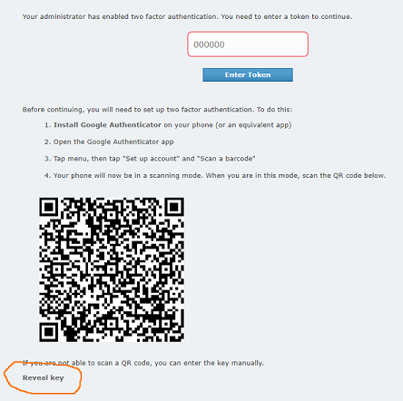

Why Should I Use This?
----------------------

The goal of pyPreservica is to allow you to make use of the Preservica Entity API for reading and writing objects within
a Preservica repository without having to manage the underlying REST HTTPS requests and XML parsing.
The library provides a level of abstraction which reflects the underlying data model, such as structural and
information objects.

The pyPreservica library allows Preservica users to build applications which interact with the repository such as metadata
synchronisation with 3rd party systems etc.

.. hint::
    Access to the Preservica API's for the cloud hosted system does depend on which Preservica Edition has been
    licensed.  See https://preservica.com/digital-archive-software/products-editions for details.

SDK Features
-----------------------

Entity API Features
^^^^^^^^^^^^^^^^^^^^^^^^^

-  Fetch and Update Entity Objects (Folders, Assets, Content Objects)
-  Add, Delete and Update External Identifiers
-  Add, Delete and Update Descriptive Metadata Fragments
-  Change Security tags on Folders and Assets
-  Create new Folder Entities
-  Move Assets and Folders within the repository
-  Deleting Assets and Folders
-  Fetch Folders and Assets belonging to parent Folders
-  Retrieve Representations, Generations & Bitstreams from Assets
-  Download digital files and thumbnails
-  Fetch lists of changed entities over the last n days
-  Request information on completed integrity checks
-  Add or remove asset and folder icons
-  Replace existing content objects within an Asset
-  Export OPEX Package
-  Fetch audit trail events on Entities and across the repository
-  Create Relationships between Assets

Content API Features
^^^^^^^^^^^^^^^^^^^^^^^^^

-  Fetch a list of indexed Solr Fields
-  Search based on a single query term
-  Filtered searches on indexed fields

Upload API Features
^^^^^^^^^^^^^^^^^^^^^^^^^

-  Create single Content Object Packages with multiple Representations
-  Create multiple Content Object Packages with multiple Representations
-  Upload packages to Preservica
-  Spreadsheet Metadata
-  Ingest Web Video
-  Ingest Twitter Feeds

Admin API Features
^^^^^^^^^^^^^^^^^^^^^^^^^

-  Schema Management (XML Templates, XSD Schema's & XSLT Transforms)
-  User Management (create and remove user accounts)
-  Security Tags (add and remove security tags)

Retention Management API Features
^^^^^^^^^^^^^^^^^^^^^^^^^^^^^^^^^^^^^^^^^

-  Create new retention policies
-  Delete retention policies
-  Update retention policies
-  Assign retention policies to entities

Workflow API Features
^^^^^^^^^^^^^^^^^^^^^^^^^

- Get Workflow Contexts
- Get Workflow Instance
- Start Workflow Instances

Webhook API Features
^^^^^^^^^^^^^^^^^^^^^^^^^

- Subscribe to Webhook endpoints
- Unsubscribe
- List Subscriptions

Authority Records API Features
^^^^^^^^^^^^^^^^^^^^^^^^^^^^^^^^

-  Get an Authority table by its reference
-  List all Authority tables
-  Return all records from a Authority table
-  Add records to an Authority table
-  Delete records from an Authority table

New Generation Groups and Forms Features
^^^^^^^^^^^^^^^^^^^^^^^^^^^^^^^^^^^^^^^^^

-  Create new Groups
-  Delete Groups
-  Add new metadata fields to an existing Group
-  Fetch existing Groups

Background
------------

They key to working with the pyPreservica library is that the services follow the Preservica core data model closely.

.. image:: images/entity-API.jpg

The Preservica data model represents a hierarchy of entities, starting with the **structural objects** which are used to
represent aggregations of digital assets. Structural objects define the organisation of the data. In a library context
they may be referred to as collections, in an archival context they may be Fonds, Sub-Fonds, Series etc and in a
records management context they could be simply a hierarchy of folders or directories.

These structural objects may contain other structural objects in the same way as a computer filesystem may contain
folders within folders.

Within the structural objects comes the **information objects**. These objects which are sometimes referred to as the
digital assets are what PREMIS defines as an Intellectual Entity. Information objects are considered a single
intellectual unit for purposes of management and description: for example, a book, document, map, photograph or database etc.

**Representations** are used to define how the information object are composed in terms of technology and structure.
For example, a book may be represented as a single multiple page PDF, a single eBook file or a set of single page image files.

Representations are usually associated with a use case such as access or long-term preservation.
All Information objects have a least one representation defined by default. Multiple representations can be either
created outside of Preservica through a process such as digitisation or within Preservica through preservation processes such a normalisation.

**Content Objects** represent the components of the asset. Simple assets such as digital images may only contain a
single content object whereas more complex assets such as books or 3d models may contain multiple content objects.
In most cases content objects will map directly to digital files or bitstreams.

**Generations** represent changes to content objects over time, as formats become obsolete new generations may need
to be created to make the information accessible.

**Bitstreams** represent the actual computer files as ingested into Preservica, i.e. the TIFF photograph or the PDF document.

PIP Installation
----------------

pyPreservica is available from the Python Package Index (PyPI)

https://pypi.org/project/pyPreservica/

pyPreservica is built and tested against Python 3.8. Older versions of Python may not work.

To install pyPreservica, simply run this simple command in your terminal of choice:

.. code-block:: console

    $ pip install pyPreservica

or you can install in a virtual python environment using:

.. code-block:: console

    $ pipenv install pyPreservica

pyPreservica is under active development and the latest version is installed using

.. code-block:: console

    $ pip install --upgrade pyPreservica

Get the Source Code
-------------------

pyPreservica is developed on GitHub, where the code is
`always available <https://github.com/carj/pyPreservica>`_.

You can clone the public repository

.. code-block:: console

    $ git clone git://github.com/carj/pyPreservica.git

Contributing
------------

Bug reports and pull requests are welcome on GitHub at https://github.com/carj/pyPreservica

Support
------------

pyPreservica is 3rd party open source client and is
not affiliated or supported by `Preservica Ltd <https://preservica.com/>`_

For announcements about new versions and discussion of pyPreservica please subscribe to the google groups
forum https://groups.google.com/g/pypreservica

Bug reports can be raised directly on either `GitHub <https://github.com/carj/pyPreservica>`_ or on the google group forum

General questions and queries about using pyPreservica posted on the google group forum above.

Examples
------------

Using the python console, create the entity API client object and request an Asset
(Information Object) by its unique reference and display some of its attributes.

All entities within the Preservica system have one unique reference which can be used to retrieve them.

The reference used to fetch entities (Assets, Folders) is the Preservica internal unique identifier.
This is a universally unique identifier `(UUID) <https://en.wikipedia.org/wiki/Universally_unique_identifier>`_

You can find the reference when viewing the object metadata within Explorer. Later on we will look at how we can fetch
entities using other 3rd party external identifiers which may be more meaningful such as ISBNs DOIs etc.

To create the client object you will need valid credentials to connect to the Preservica server. See the following
section on available authentication options.

.. code-block:: python

    >>> from pyPreservica import *
    >>> client = EntityAPI()
    >>> client
    pyPreservica version: 0.8.5  (Preservica 6.2 Compatible)
    Connected to: us.preservica.com Version: 6.2.0 as test@test.com
    >>> asset = client.asset("dc949259-2c1d-4658-8eee-c17b27a8823d")
    >>> asset.reference
    'dc949259-2c1d-4658-8eee-c17b27a8823d'
    >>> asset.title
    'LC-USZ62-20901'
    >>> asset.parent
    'ae108c8f-b058-4228-b099-6049175d2f0c'
    >>> asset.security_tag
    'open'
    >>> asset.entity_type
    <EntityType.ASSET: 'IO'>

If your credentials are valid, pyPreservica returns a client object which is the connection to the server. Printing the client
returns information about the connection such as the server and the user name etc. This can be useful to check that you are connected to
the correct system.

All entities have a parent reference attribute, for Assets this always points to the parent Folder.
For Content Objects the parent points to the Asset and for Folders it points to the parent Folder if it exists.
Folders at the root level of the repository do not have a parent and the attribute returns the special Python
value of ``None``

This example shows how pyPreservica can be used to upload and ingest a local file, picture.tiff
into Preservica using the UploadAPI class. The tiff file will be ingested as a new Asset object inside the existing Preservica folder given 
by the folder UUID.
The ``simple_asset_package`` function creates the package, in this case an XIPv6 formatted package and the ``upload_zip_package`` method
uploads it directly to the Preservica server using the S3 protocol.

.. code-block:: python

    >>> from pyPreservica import *

    >>> client = UploadAPI()
    >>> folder = "dc949259-2c1d-4658-8eee-c17b27a8823d"
    >>> zip_p = simple_asset_package(preservation_file="picture.tiff", parent_folder=folder)
    >>> client.upload_zip_package(zip_p)

Authentication
-----------------

pyPreservica provides 4 different methods for authentication. The library requires the username and password of a
Preservica user and an optional Tenant identifier along with the server hostname.

.. tip::
    The Tenant parameter is now optional when connecting to a Preservica 6.3 system.

1 **Method Arguments**

Include the user credentials as arguments to the EntityAPI Class

.. code-block:: python

    from pyPreservica import *

    client = EntityAPI(username="test@test.com", password="123444",
                       tenant="PREVIEW", server="preview.preservica.com")

If you don't want to include your Preservica credentials within your python script because you are sharing scripts or 
using a version control system then one of the following two methods should be used.

2 **Environment Variable**

Export the credentials as environment variables as part of the session

.. code-block:: console

    $ export PRESERVICA_USERNAME="test@test.com"
    $ export PRESERVICA_PASSWORD="123444"
    $ export PRESERVICA_TENANT="PREVIEW"
    $ export PRESERVICA_SERVER="preview.preservica.com"

    $ python3

.. code-block:: python

    from pyPreservica import *

    client = EntityAPI()

3 **Properties File**

Create a properties file called "credentials.properties" with the following property names
and save to the working directory ::

    [credentials]
    username=test@test.com
    password=123444
    tenant=PREVIEW
    server=preview.preservica.com

.. code-block:: python

    from pyPreservica import *

    client = EntityAPI()

You can create a new credentials.properties file automatically using the ``save_config()`` method

.. code-block:: python

    from pyPreservica import *

    client = EntityAPI(username="test@test.com", password="123444",
                          tenant="PREVIEW", server="preview.preservica.com")
    client.save_config()

4 **Shared Secrets**

pyPreservica now supports authentication using shared secrets rather than a login account username and password.
This allows a trusted external applications such as pyPreservica to acquire a Preservica API authentication token
without having to use a set of login credentials.

This option is useful if you want to provide limited API access to a 3rd party without providing login access to Preservica.

To use the shared secret authentication you need to add a secure secret key to your Preservica system.

The username, password, tenant and server attributes are used as normal, the password field now holds the shared
secret and not the users password.

.. code-block:: python

    from pyPreservica import *

    client = EntityAPI(username="test@test.com", password="shared-secret", tenant="PREVIEW",
                          server="preview.preservica.com", use_shared_secret=True)

If you are using a credentials.properties file then

.. code-block:: python

    from pyPreservica import *

    client = EntityAPI(use_shared_secret=True)

2 Factor Authentication
------------------------

pyPreservica now supports the new 2-Factor authentication for APIs introduced with Preservica 6.8

The Preservica system should be first setup for 2-Factor authentication and the one time password key used to
seed the 2FA (HMAC-Based One-Time Password Algorithm) should be retained and used with the API.

The one time password or seed key is available to view and should be saved when setting up the 2FA for a user.
You can find the two factor seed key from the user 2FA setup page under the "Reveal Key" button at the bottom of the page.

Keep this key secret along with your account password as it will be required when authenticating the API calls.

To call pyPreservica once 2-Factor authentication process has been setup, you need the username and password as normal along
with the additional two factor key.

You can pass the additional two factor key as an argument to the constructor for the API classes or use environment
variables or the credentials file.

.. code-block:: python

    from pyPreservica import *

    client = EntityAPI(username="test@test.com", password="my-login-password", tenant="PREVIEW",
                          server="preview.preservica.com", two_fa_secret_key="AJC5DEGUVM6UQ1TT")

The environment variable for holding the 2 factor seed key is called `PRESERVICA_2FA_TOKEN` and the credential file
property name is `twoFactorToken`.

.. code-block:: console

    $ export PRESERVICA_2FA_TOKEN=AJC5DEGUVM6UQ1TT

i.e ::

    [credentials]
    username=test@test.com
    password=123444
    tenant=PREVIEW
    server=preview.preservica.com
    twoFactorToken=AJC5DEGUVM6UQ1TT

.. tip::
    Preservica uses time based One Time Passwords (OTP), this means the time on your local machine must match time
    on the server.

SSL Certificates
-----------------

pyPreservica will by default connect to servers which use the https:// protocol and will always validate certificates
when connected via https.

For Enterprise on Premise customers on secure networks, you can change the default protocol to use http:// via the constructor.

.. code-block:: python

    client = EntityAPI(protocol="http")

pyPreservica uses the `Certifi <https://pypi.org/project/certifi/>`_  project to provide SSL certificate validation.

Self-signed certificates used by on-premise deployments are not part of the Certifi certification authority (CA)
bundle and therefore need to be set explicitly.

The CA bundle is a file that contains root and intermediate certificates.
The end-entity certificate along with a CA bundle constitutes the certificate chain.

For on-premise deployments the trusted CAs can be specified through the ``REQUESTS_CA_BUNDLE``
environment variable. e.g.

.. code-block:: console

    $ export REQUESTS_CA_BUNDLE=/usr/local/share/ca-certificates/my-server.cert

Application Logging
-------------------

You can add logging to your pyPreservica scripts by simply including the following

.. code-block:: python

    import logging
    from pyPreservica import *

    logging.basicConfig(level=logging.DEBUG)

    client = EntityAPI()

This will log all messages from level DEBUG or higher to standard output, i.e the console.

When logging to files, the main thing to be wary of is that log files need to be rotated regularly.
The application needs to detect the log file being renamed and handle that situation.
While Python provides its own file rotation handler, it is best to leave log rotation to dedicated tools such as logrotate.
The WatchedFileHandler will keep track of the log file and reopen it if it is rotated,
making it work well with logrotate without requiring any specific signals.

Here’s a sample implementation.

.. code-block:: python

    import logging
    import logging.handlers
    import os

    from pyPreservica import *

    handler = logging.handlers.WatchedFileHandler("pyPreservica.log")
    formatter = logging.Formatter(logging.BASIC_FORMAT)
    handler.setFormatter(formatter)
    root = logging.getLogger()
    root.setLevel(logging.DEBUG)
    root.addHandler(handler)

    client = EntityAPI()

Low Level Logging
^^^^^^^^^^^^^^^^^^^^^

pyPreservica now provides low level event hooks into the underlying API requests to the server.
To use this functionality, create a call back function with the following signature `call_back(r, *args, **kwargs)`

The first argument is the request object which can be queried.

This API allows clients to do things such as audit all the API endpoints which are called for example.

.. code-block:: python

    def print_url(r, *args, **kwargs):
        print(r.url)

    client = EntityAPI(request_hook=print_url)

    for f in client.descendants():
        pass

https://us.preservica.com/api/accesstoken/login
https://us.preservica.com/api/entity/versiondetails/version
https://us.preservica.com/api/user/details
https://us.preservica.com/api/entity/root/children?start=0&max=100

