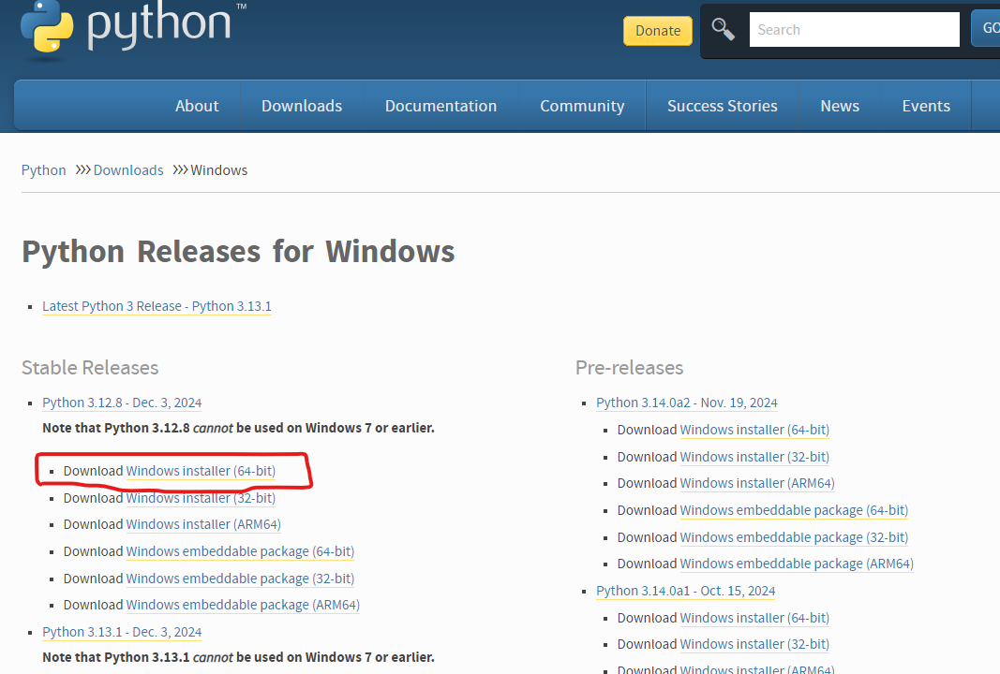
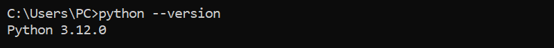

Tutorial for Archivists
~~~~~~~~~~~~~~~~~~~~~~~~

Python Runtime
^^^^^^^^^^^^^^^^

There are a few prerequisites to setup before you can start using the pyPreservica SDK.
The first is that you need a Python runtime installing on the computer you want to use.

Windows does not have the Python programming language installed by default.
However, you can install Python on Windows in just a few easy steps.

MS Windows users can install Python directory from the python.org website using https://www.python.org/downloads/windows/

For most users the 64-bit Windows Installer is the way to go.

After downloading run the installer making sure to check the box which will add the python.exe to
your path.

After the install has completed you should verify the install has worked and python will run.

Open the Windows command prompt or Terminal application and run the following command:

.. code-block:: shell

    python --version

You should a version number printed on the screen

For a more comprehensive set of instructions see https://docs.python.org/3/using/windows.html

Development Environment
^^^^^^^^^^^^^^^^^^^^^^^^

If you are going to be creating new pyPreservica scripts rather than just running existing scripts then a
dedicated Python development environment makes things easier.

There a two excellent Python development environments which are free to use, `MS Visual Code <https://code.visualstudio.com/>`_ and
`JetBrains PyCharm Community Edition <https://www.jetbrains.com/pycharm/>`_ .

The following tutorial provides a detailed description of setting up your first project using PyCharm

https://www.jetbrains.com/help/pycharm/creating-and-running-your-first-python-project.html

