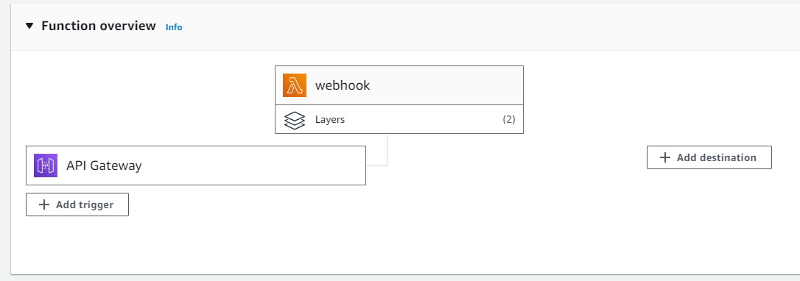

WebHook API
~~~~~~~~~~~~~~~

pyPreservica now contains APIs for accessing the web hook API.

Webhooks are "user-defined HTTP callbacks". They are triggered by some Preservica event, such as ingesting objects
into the repository. When that event occurs, Preservica makes an HTTP request to the URL configured for the webhook.

Unlike the traditional process of "polling" in which a client asks the repository if anything has changed, web hooks
automatically send out information to subscribed systems when certain events have happened.

To receive web hook notifications the 3rd party application requires a web server which can process HTTP POST requests.

To authenticate messages from Preservica to prevent spoofing attacks, the messages are verified through the use of a
shared secret key.

The Webhook API requires the user to have at least the repository manager role, ROLE_SDB_MANAGER_USER

Subscribing
^^^^^^^^^^^^^

Before a system can receive notifications from Preservica, it must subscribe to a notification trigger.

Preservica currently supports four different triggers:

* "MOVED"               An Entity has been moved
* "SECURITY_CHANGED"    The security tag on an Entity has changed
* "INDEXED"             The ingest has completed and the search index updated
* "INGEST_FAILED"       The ingest failed

The "Indexed" notification is sent after an object has been ingested and the full text index has been extracted,
at this point the thumbnail and search contents are available.

When creating a new subscription service you need to generate a shared secret key and pass it as an argument to the
subscribe method. This is used to verify the web service which will receive the web hooks.

The URL must be a publicly addressable web server.

.. code-block:: python

    webhook = WebHooksAPI()

    webhook.subscribe("http://my-webhook-server.com:8080/", TriggerType.INDEXED, "my_shared_secret")

The given URL host will need to respond to a validation challenge during the subscription request.
Preservica will make a POST request to the URL with a challengeCode query parameter.
The receiver must respond with the expected challenge response or the subscription will fail.
The challenge response must take the form:

.. code-block:: python

    {
            "challengeCode": "challengeCode",
            "challengeResponse": "hexHmac256Response"
    }

where hexHmac256Response is a hex hmac256 of the challengeCode using the shared secret as the hmac key.

If the web server is unable to correctly verify the subscription then an exception is thrown.

Listing Subscriptions
^^^^^^^^^^^^^^^^^^^^^

You can query the system for a list of current subscriptions for a tenancy.

.. code-block:: python

    webhook = WebHooksAPI()

    json_doc = webhook.subscriptions()

    print(json_doc)

Unsubscribe
^^^^^^^^^^^^^^^^^^^^^

To unsubscribe to a web hook, you need the subscription id

.. code-block:: python

    webhook = WebHooksAPI()

    webhook.unsubscribe("c306c99ca3a736124fa711bec53c737d")

To unsubscribe to all web hooks use

.. code-block:: python

    webhook = WebHooksAPI()

    webhook.unsubscribe_all()

Reference Web Server
^^^^^^^^^^^^^^^^^^^^^^^

To receive web hook notifications pyPreservica has provided a reference web server implementation which provides
support for negotiation of the challenge request handshake during the subscription request and
verification of each webhook event request.

To implement the web server, extend the base class `WebHookHandler` and implement a single method `do_WORK()`
this method is called everytime Preservica calls the web hook.
This method is therefore where any processing takes place. For example updating a catalogue system etc.

.. code-block:: python

    class MyWebHook(WebHookHandler):
        def do_WORK(self, json_payload):
        """
        Process the event
        """

The handler can then be used to create a web server, the web server should be run from the same directory as a
`credential.properties` file containing the shared secret which was used to create the web hook subscription.

 .. code-block:: python

    [credentials]
    secret.key=my_shared_secret

For example a simple web hook server which prints the events to the console as they arrive would be:

 .. code-block:: python

    from http.server import HTTPServer
    from sys import argv
    from pyPreservica import *

    
    class MyWebHook(WebHookHandler):
        def do_WORK(self, json_payload):
            print(json_payload)

    if __name__ == '__main__':

        config = configparser.ConfigParser(interpolation=configparser.Interpolation())
        config.read('credentials.properties', encoding='utf-8')
        secret_key = config['credentials']['secret.key']

        if len(argv) > 1:
            arg = argv[1].split(':')
            BIND_HOST = arg[0]
            PORT = int(arg[1])

        print(f'Listening on http://{BIND_HOST}:{PORT}\n')

        httpd = HTTPServer((BIND_HOST, PORT), MyWebHook)
        httpd.secret_key = secret_key
        httpd.serve_forever()

The web server would then be started using:

 .. code-block:: shell

    $ python3 server.py 0.0.0.0:8000

A more interesting web hook handler might be one which downloads the thumbnail image from each Asset as it is ingested
using the pyPreservica EntityAPI()

 .. code-block:: python

    class MyWebHook(WebHookHandler):
        def do_WORK(self, json_payload):
            client = EntityAPI()
            for reference in list(json_payload['events']):
                ref = reference['entityRef']
                asset = client.asset(ref)
                client.thumbnail(asset, f"{ref}.jpg")

Event Driven Serverless Architecture
^^^^^^^^^^^^^^^^^^^^^^^^^^^^^^^^^^^^^^^

In the examples above, a web server is used to receive the web hook notifications.
This can turn out to be inefficient as the web server needs to be running on a server even when no notifications are being sent.

In turns out that webhooks are especially well suited to modern serverless architecture such as Amazon Lambda and Azure Functions.
Running a dedicated web server can be inefficient and unnecessary.

AWS Lambda and Azure Functions are code fragments which are triggered to run from external events such as web hooks.
This is a simple and cost-effective approach to processing events.

* No application server provisioning and maintenance required
* Web server infrastructure is provided for you through the API Gateway
* Only pay for the milliseconds used
* Highly Scalable
* Secure

AWS has a dedicated set of infrastructure based on the API Gateway service which allows public API endpoints to be created.
These API endpoints act as the "front door" for the webhook applications managing traffic management,
CORS support, authorization and access control, throttling, and monitoring etc.
For the Preservica webhook use case the API gateway only needs to accept HTTP POST requests.

When the API gateway receives a webhook notification it will pass the message payload from Preservica to the
AWS Lambda function which will carry out the appropriate action.

AWS Lambda supports multiple languages such as Java, Go, PowerShell, Node.js, C#, Python, and Ruby code,
so you can build your applications in the language of your choice.

A basic AWS Lambda function for Preservica web hooks in Python would look something like:

 .. code-block:: python

    import json
    import os
    import hmac
    import hashlib

    def lambda_handler(event, context):
        secret_key = os.environ.get('PRES_SECRET_KEY')
        if 'queryStringParameters' in event:
            if event['queryStringParameters'] is not None:
                if 'challengeCode' in event['queryStringParameters']:
                    message = event['queryStringParameters']['challengeCode']
                    signature = hmac.new(key=bytes(secret_key, 'latin-1'), msg=bytes(message, 'latin-1'),
                                         digestmod=hashlib.sha256).hexdigest()
                    return {
                        "statusCode": 200,
                        "headers": {
                            "Content-Type": "application/json"
                        },
                        "body": json.dumps({
                            "challengeCode": f"{message}", "challengeResponse": f"{signature}"})
                    }
        else:
            if 'Preservica-Signature' in event['headers']:
                verify_body = f"preservica-webhook-auth{event['body']}"
                signature = hmac.new(key=bytes(secret_key, 'latin-1'), msg=bytes(verify_body, 'latin-1'),
                                     digestmod=hashlib.sha256).hexdigest()
                doc = json.loads(event['body'])
                if signature == event['headers']['Preservica-Signature']:
                    for reference in list(doc['events']):
                        ref = reference['entityRef']
                        ## DO WORK HERE
                    return {
                        "statusCode": 200,
                        "headers": {
                            "Content-Type": "application/json"
                        },
                        "body": json.dumps(event['body'])
                    }

Where we are fetching the shared key from the environment variables.